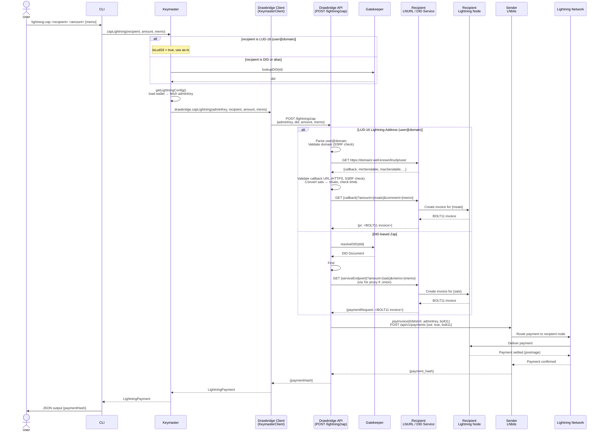

# Lightning Zap

A lightning zap sends sats from the user's Lightning wallet to a recipient identified by either a **DID** (Decentralized Identifier), an **alias**, or a **LUD-16 Lightning Address** (e.g. `user@domain.com`).

## Overview

The flow has three distinct phases:

1. **Resolve the recipient** — identify who to pay and how to reach their Lightning node.
2. **Fetch an invoice** — ask the recipient's server to generate a BOLT11 payment request for the requested amount.
3. **Pay the invoice** — submit the BOLT11 to the sender's LNbits instance, which routes the payment over the Lightning Network.

## Phase 1 — Resolve the recipient

The user invokes `lightning-zap <recipient> <amount> [memo]` from the CLI. The Keymaster class inspects the recipient string:

- If it contains `@` and does not start with `did:`, it is treated as a **LUD-16 Lightning Address** and used directly.
- Otherwise it is treated as a DID or human-readable alias and resolved to a full DID via Gatekeeper.

Keymaster also loads the sender's wallet to retrieve the `adminKey` for their LNbits wallet, which will be used to authorise the payment.

## Phase 2 — Fetch an invoice

Keymaster delegates to the Drawbridge service (`POST /lightning/zap`), which handles both recipient types:

**LUD-16 Lightning Address**

Drawbridge parses the `user@domain` string and performs two HTTP requests against the recipient's LNURL server (SSRF-protected — HTTPS required, private IPs blocked):

1. `GET https://domain/.well-known/lnurlp/user` — retrieves the LNURL pay metadata, including the callback URL and the min/max sendable amounts.
2. `GET {callback}?amount={msats}&comment={memo}` — requests a BOLT11 invoice for the specific amount (converted to millisats). The recipient's LNURL server asks their Lightning node to generate the invoice and returns it in the response.

**DID-based Zap**

Drawbridge resolves the recipient DID via Gatekeeper to obtain their DID Document, then locates the `#lightning` service endpoint. It validates the endpoint URL (`.onion` addresses must use `http://` and are proxied via Tor; clearnet addresses must use `https://`). It then calls `GET {serviceEndpoint}?amount={sats}&memo={memo}`, and the recipient's Lightning service generates and returns a BOLT11 invoice.

## Phase 3 — Pay the invoice

Drawbridge submits the BOLT11 invoice to the sender's LNbits instance (`POST /api/v1/payments`), which routes the payment across the Lightning Network to the recipient's node. Once the recipient's node settles the payment and returns the preimage, the network confirms success back to LNbits. Drawbridge returns the `paymentHash` up the call stack to the CLI, which prints it as JSON.

## Sequence Diagram

