# Archon: A Decentralized Identity Protocol

## White Paper v1.2

**Abstract**

Archon is a decentralized identity (DID) protocol implementing the W3C-compliant `did:cid` scheme. It provides a comprehensive peer-to-peer identity infrastructure that enables secure, verifiable decentralized identities anchored to IPFS and multiple blockchain registries. By separating DID creation (via content-addressable storage) from DID updates (via distributed registries), Archon combines instant identity creation carrying no registry transaction fee with cryptographically secure, consensus-driven updates. Identities interoperate with the wider ecosystem through a Universal Resolver-style resolution interface — with documented media-type and content-negotiation deviations (§5.5) — DIDComm v2 confidential messaging, and a Model Context Protocol server that exposes the wallet to AI agents.

---

## Table of Contents

1. [Introduction](#1-introduction)
2. [Problem Statement](#2-problem-statement)
3. [The Archon Solution](#3-the-archon-solution)
4. [Technical Architecture](#4-technical-architecture)
5. [The did:cid Method](#5-the-didcid-method)
6. [The didDocumentData Extension](#6-the-diddocumentdata-extension)
7. [Registry System](#7-registry-system)
8. [Advanced Features](#8-advanced-features)
9. [Verifiable Credentials](#9-verifiable-credentials)
10. [Cryptographic Foundation](#10-cryptographic-foundation)
11. [Network Topology](#11-network-topology)
12. [Use Cases](#12-use-cases)
13. [Comparison with Existing Solutions](#13-comparison-with-existing-solutions)
14. [Future Directions](#14-future-directions)
15. [Conclusion](#15-conclusion)

---

## 1. Introduction

The digital age has created an identity paradox. While individuals generate more personal data than ever before, control over that data has concentrated in the hands of a few large platforms. Traditional identity systems—whether government-issued, corporate-managed, or platform-specific—share fundamental limitations: centralized control, single points of failure, and the inability to provide true user sovereignty.

Decentralized Identifiers (DIDs), as specified by the World Wide Web Consortium (W3C), offer a path forward. DIDs are globally unique identifiers that enable verifiable, decentralized digital identity without requiring a centralized registry. However, existing DID implementations face practical challenges: blockchain-based methods incur transaction costs and confirmation delays, while purely peer-to-peer approaches lack the finality guarantees required for high-stakes applications.

Archon addresses these challenges through a novel architectural approach that separates identity creation from identity updates, achieving both instant availability and cryptographic finality through its multi-registry design.

---

## 2. Problem Statement

### 2.1 The Centralization Problem

Current digital identity systems concentrate authority in centralized entities. Whether a government agency, a social media platform, or an enterprise identity provider, these systems create:

- **Single points of failure**: Service outages or organization failures can invalidate identities
- **Privacy vulnerabilities**: Centralized databases become attractive targets for attackers
- **Censorship risks**: Central authorities can revoke identities without recourse
- **Vendor lock-in**: Users cannot port their identity between systems

### 2.2 The Blockchain Trilemma for Identity

Existing blockchain-based DID methods face a trilemma between:

1. **Cost**: On-chain operations require transaction fees, making identity creation economically infeasible for many use cases
2. **Speed**: Blockchain confirmation times (minutes to hours) create unacceptable latency for real-time applications
3. **Decentralization**: Solutions that address cost and speed often compromise on decentralization

### 2.3 The Verification Gap

Even when decentralized identities exist, verifying them requires:

- Access to the same network infrastructure
- Trust in the resolution mechanism
- Ability to validate cryptographic proofs

Many existing systems fail to provide portable, universally verifiable identity documents.

---

## 3. The Archon Solution

### 3.1 Core Innovation: Separation of Creation and Updates

Archon's fundamental insight is that DID creation and DID updates have fundamentally different requirements:

**Creation** requires:
- Speed (immediate availability)
- Low/zero cost (enabling mass adoption)
- Decentralization (no gatekeepers)

**Updates** require:
- Ordering guarantees (prevent replay attacks)
- Finality (irreversible once confirmed)
- Auditability (verifiable history)

By separating these concerns, Archon achieves optimal characteristics for each:

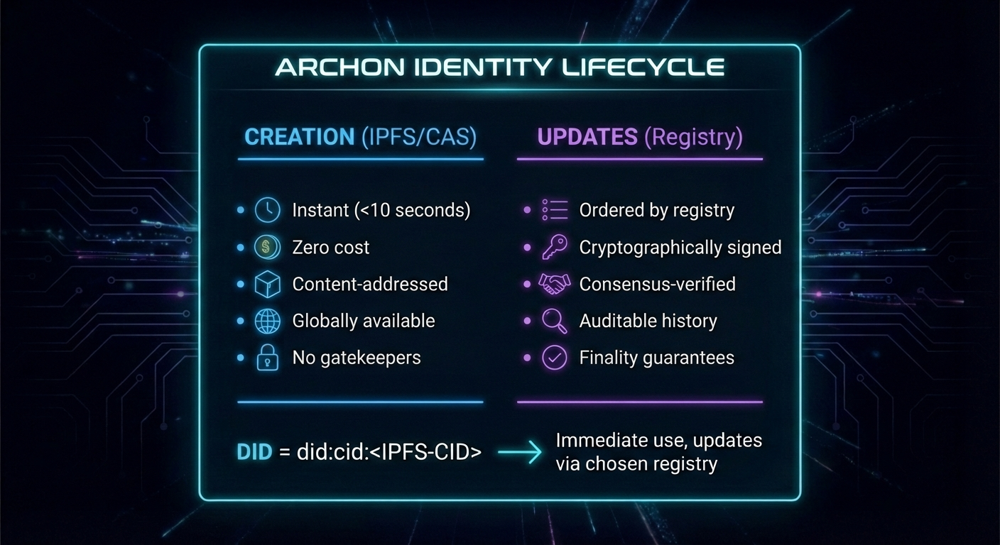

### 3.2 Multi-Registry Architecture

Rather than mandating a single consensus mechanism, Archon supports multiple registries, each with different characteristics:

| Registry | Confirmation Time | Cost | Finality | Best For |
|----------|-------------------|------|----------|----------|
| Hyperswarm | Seconds | Free | Eventual | Development, internal systems |
| Bitcoin-family (`BTC:mainnet`, `BTC:testnet4`, `BTC:signet`) | ~60 minutes (6 blocks) | Miner fee per batch; testnet/signet use test coins | Strong proof-of-work finality | Enterprise, legal identity, testing |
| Zcash (`ZEC:mainnet`, `ZEC:testnet`) | First confirmation in ~75 seconds | ZIP-317 conventional fee per batch; testnet uses test coins | Strong proof-of-work finality | Transparent Zcash anchoring |
| Ethereum (`ETH:mainnet`, `ETH:sepolia`) | ~2-3 minutes at the default 12-confirmation import depth | Gas for one `ArchonRegistry` transaction per batch | Strong EVM block finality | EVM anchoring and contract discovery |
| Solana (`SOL:mainnet-beta`, `SOL:devnet`) | Seconds at `confirmed`; tens of seconds at `finalized` | Lamports for one Memo transaction per batch | Fast proof-of-stake finality | High-throughput anchoring |

Users select their registry at DID creation based on their specific requirements, enabling a spectrum of security-cost trade-offs.

### 3.3 Standards Compliance

Archon implements the W3C DID Core 1.0 specification, ensuring interoperability with the broader decentralized identity ecosystem:

- Standard DID document structure
- Verification methods and authentication
- Service endpoints
- DID resolution and dereferencing with conformant metadata

Beyond the native API, Archon exposes a dedicated resolution interface at `/1.0/identifiers` (see §5.5) following the Universal Resolver convention: the resolution-result triple, content-type negotiation, and standard `resolutionMetadata.error` codes including `invalidDid` and `notFound`. Both the TypeScript and Rust Gatekeeper implementations serve this interface, each covered by its own test suite.

Beyond DID Core, Archon builds on:

- **W3C Verifiable Credentials** for the credential model (§9)
- **DIDComm v2** (DIF) for confidential, transport-agnostic messaging (§8.9)
- **RFC 8785 (JCS)** for canonical JSON in signing and content addressing (§10)
- **Model Context Protocol** for exposing identity operations to AI agents (§12.8)

---

## 4. Technical Architecture

### 4.1 System Overview

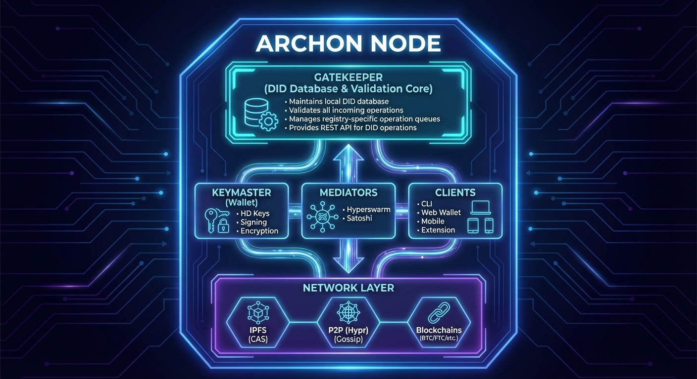

### 4.2 Core Components

#### Gatekeeper

The Gatekeeper serves as the authoritative local source for DID state. It:

- Receives and validates DID operations
- Maintains operation queues per registry
- Merges operations from multiple sources
- Provides a REST API for DID CRUD operations
- Supports multiple database backends (Redis, MongoDB, SQLite)

#### Keymaster

The Keymaster is the client-side wallet library responsible for:

- BIP-32 hierarchical deterministic key derivation
- BIP-39 mnemonic seed phrase management
- ECDSA signing of DID operations
- Encryption/decryption of messages and credentials
- Wallet backup and recovery

#### Drawbridge

Drawbridge is an API gateway that bridges the Archon identity layer with the Lightning Network:

- Proxies Gatekeeper and Keymaster APIs with optional paywall protection
- Manages Lightning Network node connectivity (Core Lightning)
- Provides invoice generation, payment, and routing for DID-to-DID Lightning transactions
- Supports L402 (formerly LSAT) authentication for API monetization
- Exposes Lightning service endpoints via DID document service entries
- Optionally fronted by a Tor hidden service for privacy-preserving access

#### DIDComm Service

A dedicated service owns DIDComm v2 *transport*, keeping message crypto in the wallet (see §8.9):

- Receives inbound `application/didcomm-encrypted+json` envelopes at a published endpoint
- Queues envelopes in a per-identity mailbox, released only against a signed challenge proving DID control
- Delivers all outbound envelopes on the wallet's behalf, so egress can traverse Tor without exposing the wallet host
- Holds no private keys and cannot read message content; it parses only envelope headers, which is enough to route and no more

#### MCP Server

An stdio Model Context Protocol server (`@didcid/mcp-server`) exposes the wallet to AI agents and MCP-compatible tools:

- Serves the Keymaster operation surface as typed MCP tools with JSON Schema inputs
- Runs locally against the user's own wallet file and passphrase, connecting outward to Gatekeeper/Drawbridge for registry access
- Returns native MCP content blocks, linking large assets by resource URI rather than inlining them
- Redacts secrets from *error* messages, so credentials embedded in URLs or assignments are not leaked through a failure path

Redaction covers errors, not results: successful tool results are serialized as returned. Several tools return wallet material directly, and the gating on them is inconsistent:

| Tool | Returns | Gate |
|---|---|---|
| `archon_show_mnemonic` | recovery phrase | `reveal: true` |
| `archon_show_wallet` | decrypted `WalletFile` | `reveal: true` |
| `archon_new_wallet` | decrypted `WalletFile` | confirmation argument |
| `archon_create_wallet` | decrypted `WalletFile` | **none** — empty input schema |

`archon_create_wallet` loads the wallet if one already exists, so it returns the same decrypted `WalletFile` as `archon_show_wallet` with nothing gating it. The tool surface is therefore **not a key-custody boundary**: an agent that can call arbitrary tools can obtain the wallet's key material. What the server itself guarantees is narrower — it never uploads the wallet or passphrase of its own accord, and stdio bounds only the hop to its MCP host. Where a result travels after that is the host's business, and a host backed by a remote model will forward a returned `WalletFile` like any other tool output. Operators needing an actual boundary must restrict the tool set, not rely on the transport.

#### Mediators

Mediators synchronize DID operations across network boundaries:

- **Hyperswarm Mediator**: Distributes operations via P2P gossip protocol
- **Satoshi Mediator**: Anchors operation batches to Bitcoin-family registries via OP_RETURN
- **Zcash Mediator**: Anchors operation batches to transparent Zcash transactions
- **Ethereum Mediator**: Anchors operation batches through canonical `ArchonRegistry` contracts
- **Solana Mediator**: Anchors operation batches through Memo-program payloads

### 4.3 Data Flow

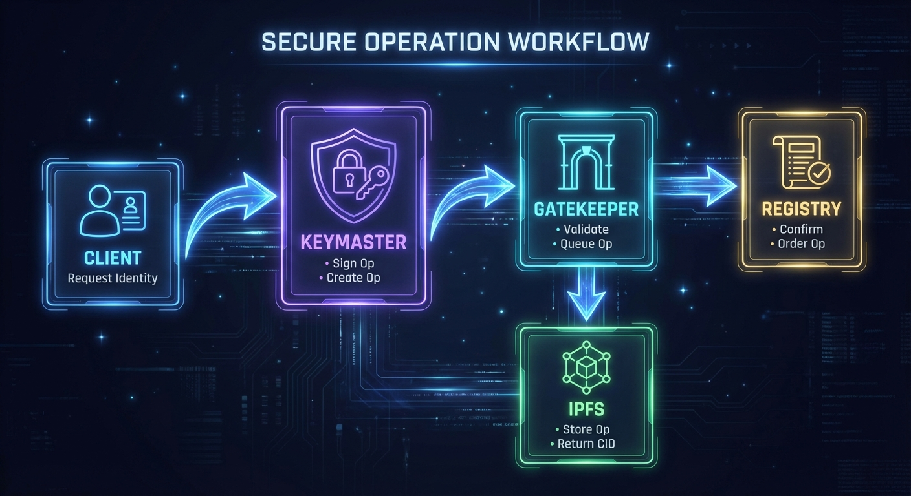

---

## 5. The did:cid Method

### 5.1 Method Specification

The `did:cid` method leverages Content Identifiers (CIDs) from IPFS to create self-certifying, content-addressed DIDs:

```
did:cid:<cid>[;service][/path][?query][#fragment]
```

Where:
- `cid`: A CIDv1 encoded in base32 (multibase prefix 'b')
- Optional components follow standard DID URL syntax

Example:
```
did:cid:bafkreig6rjxbv2aopv47dgxhnxepqpb4yrxf2nvzrhmhdqthojfdxuxjbe
```

### 5.2 DID Types

Archon supports two fundamental DID types:

**Agent DIDs**
- Possess cryptographic keys
- Can sign operations
- Controlled by a private key holder
- Used for: users, organizations, services, IoT devices

**Asset DIDs**
- No cryptographic keys
- Controlled by an owning Agent DID
- Used for: credentials, schemas, documents, data

### 5.3 DID Document Structure

```json
{
  "@context": "https://w3id.org/did-resolution/v1",
  "didDocument": {
    "@context": ["https://www.w3.org/ns/did/v1"],
    "id": "did:cid:bafkreig6rjxbv2aopv47dgxhnxepqpb4yrxf2nvzrhmhdqthojfdxuxjbe",
    "verificationMethod": [{
      "id": "#key-1",
      "controller": "did:cid:bafkreig6rjxbv...",
      "type": "EcdsaSecp256k1VerificationKey2019",
      "publicKeyJwk": {
        "kty": "EC",
        "crv": "secp256k1",
        "x": "...",
        "y": "..."
      }
    }],
    "authentication": ["#key-1"],
    "assertionMethod": ["#key-1"]
  },
  "didDocumentMetadata": {
    "created": "2024-01-15T10:30:00Z",
    "updated": "2024-01-15T10:30:00Z",
    "deactivated": false,
    "versionId": "bafkrei...",
    "versionSequence": "1"
  },
  "didDocumentData": {},
  "didDocumentRegistration": {
    "registry": "hyperswarm",
    "type": "agent",
    "version": 1
  }
}
```

### 5.4 Operations

All DID state changes occur through signed operations:

**Create Operation**
```json
{
  "type": "create",
  "created": "2024-01-15T10:30:00Z",
  "registration": {
    "registry": "hyperswarm",
    "type": "agent",
    "version": 1
  },
  "publicJwk": {
    "kty": "EC",
    "crv": "secp256k1",
    "x": "...",
    "y": "..."
  },
  "proof": {
    "type": "EcdsaSecp256k1Signature2019",
    "created": "2024-01-15T10:30:00Z",
    "verificationMethod": "#key-1",
    "proofPurpose": "authentication",
    "proofValue": "..."
  }
}
```

**Update Operation**
```json
{
  "type": "update",
  "did": "did:cid:bafkrei...",
  "doc": {
    "didDocumentData": {
      "profile": {
        "name": "Alice"
      }
    }
  },
  "previd": "bafkrei...",
  "proof": {
    "type": "EcdsaSecp256k1Signature2019",
    "created": "2024-01-16T14:00:00Z",
    "verificationMethod": "did:cid:bafkrei...#key-1",
    "proofPurpose": "authentication",
    "proofValue": "..."
  }
}
```

**Delete Operation**
```json
{
  "type": "delete",
  "did": "did:cid:bafkrei...",
  "previd": "bafkrei...",
  "proof": {
    "type": "EcdsaSecp256k1Signature2019",
    "created": "2024-01-17T09:00:00Z",
    "verificationMethod": "did:cid:bafkrei...#key-1",
    "proofPurpose": "authentication",
    "proofValue": "..."
  }
}
```

### 5.5 Interoperable Resolution and Dereferencing

Archon's native `/did/:did` API is optimized for Archon clients and returns Archon-specific members alongside the DID document. For ecosystem interoperability — Universal Resolver drivers, third-party verifiers, and conformance test suites — Gatekeeper additionally exposes a standards-shaped surface at `/1.0/identifiers`, following the Universal Resolver convention:

| Endpoint | Returns |
|---|---|
| `GET /1.0/identifiers/{did}` | DID resolution result: `didDocument`, `didResolutionMetadata`, `didDocumentMetadata` |
| `GET /1.0/identifiers/{did}/data` | Dereferences the `didDocumentData` extension (§6) as a secondary resource |
| `GET /1.0/identifiers/{did}/registration` | Dereferences registration state (registry, type, version) |

This surface differs from the native API in three ways that matter for interoperability:

1. **Content negotiation.** The `Accept` header selects between `application/did+ld+json` (the default) and `application/did+json`, with q-value ordering honored.
2. **Standard error codes.** Failures return DID Core `didResolutionMetadata.error` values — `invalidDid`, `notFound`, `internalError` — rather than bare HTTP status codes. A DID whose own operation chain fails validation is classified as `notFound` (a property of the DID), not as a server error.
3. **No non-standard members.** Nothing outside the resolution result appears in the response.

Both the TypeScript and Rust Gatekeeper implementations serve this interface, each exercised by its own test suite — the Rust integration tests assert the resolution and dereferencing endpoints against committed vectors. Agreement between the two rests on porting discipline and review rather than on an automated differential harness: the implementations are not currently executed against a common suite and compared response-for-response. Consumers requiring byte-level equivalence between a TypeScript and a Rust node should verify it for their own workload. Where a public node fronts Gatekeeper with Drawbridge, the gateway forwards `/1.0/identifiers` as a public, non-paywalled route so that external resolvers can reach it without credentials.

Two deviations from the DID Resolution specification are worth stating plainly rather than glossing. First, the endpoint returns the resolution-result triple while labeling it with `application/did+json` or `application/did+ld+json`, which are DID *document* representation media types; the current DID Resolution binding specifies `application/did-resolution` for the triple. Second, content negotiation falls back to JSON-LD when no requested representation is supported, so `representationNotSupported` is never emitted. This surface is therefore best understood as the widely-deployed Universal Resolver result shape rather than a strictly conformant DID Resolution binding.

---

## 6. The didDocumentData Extension

### 6.1 Beyond the W3C Standard

One of Archon's most powerful innovations is the `didDocumentData` field—an extension to the standard DID document structure that enables arbitrary application data to be stored alongside the identity itself. While the W3C DID Core specification defines the structure of `didDocument` and `didDocumentMetadata`, it also explicitly supports extensibility through additional properties.

The W3C DID specification states that DID methods may add custom properties beyond the core specification, provided they support lossless conversion between representations. Archon leverages this extensibility to introduce `didDocumentData`: a flexible, schema-free container for application-specific data that travels with the DID throughout its lifecycle.

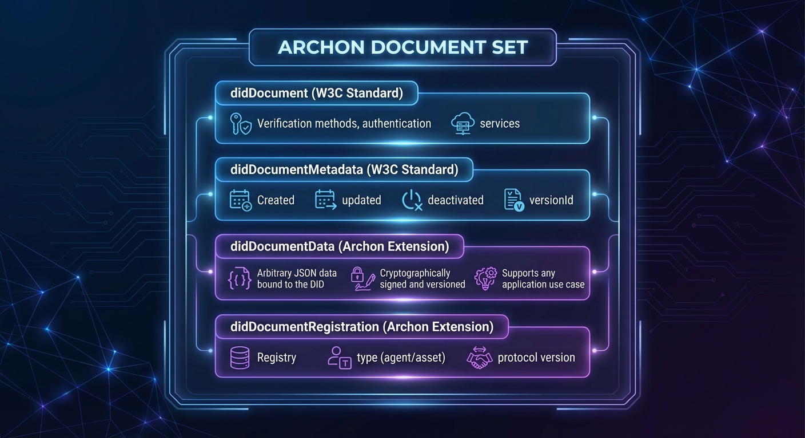

### 6.2 Design Philosophy

Traditional DID systems treat identities as static containers for cryptographic keys and service endpoints. Archon recognizes that real-world identities are dynamic, accumulating attributes, relationships, and context over time. The `didDocumentData` field transforms DIDs from mere identifiers into rich, self-sovereign data containers.

**Key Properties:**

1. **Schema-Free**: No predefined structure—applications define their own data schemas
2. **Cryptographically Bound**: All data is signed by the DID controller, ensuring authenticity
3. **Version-Controlled**: Every change creates a new version with full audit trail
4. **Decentrally Stored**: Data is distributed via IPFS and synchronized across registries
5. **Controller-Owned**: Only the DID controller can modify the data

### 6.3 Use Cases Enabled by didDocumentData

The `didDocumentData` extension unlocks an expansive range of applications that would be impossible or impractical with standard DID documents:

#### Credential Manifests

Users can publish verified credentials to their DID, creating a public or selectively-disclosed portfolio:

```json
{
  "didDocumentData": {
    "manifest": {
      "did:cid:bafkrei...degree": {
        "type": ["VerifiableCredential", "UniversityDegree"],
        "issuer": "did:cid:bafkrei...stanford",
        "credentialSubject": {
          "degree": "Bachelor of Science in Computer Science"
        }
      },
      "did:cid:bafkrei...certification": {
        "type": ["VerifiableCredential", "ProfessionalCertification"],
        "issuer": "did:cid:bafkrei...aws",
        "credentialSubject": {
          "certification": "AWS Solutions Architect"
        }
      }
    }
  }
}
```

This enables LinkedIn-style professional profiles that are fully decentralized and cryptographically verifiable.

#### Identity Vaults

Encrypted backup storage tied directly to an identity:

```json
{
  "didDocumentData": {
    "vault": "did:cid:bafkrei...encrypted-backup"
  }
}
```

Users can recover their entire identity—including all credentials and relationships—from just their seed phrase.

#### Digital Assets as DIDs

Images, documents, and structured data become first-class citizens with their own DIDs:

```json
{
  "didDocumentData": {
    "type": "image/png",
    "encoding": "base64",
    "data": "iVBORw0KGgoAAAANSUhEUgAA...",
    "metadata": {
      "title": "Profile Photo",
      "created": "2024-01-15T10:30:00Z"
    }
  }
}
```

#### Encrypted Communications

End-to-end encrypted messages stored *at rest* as DID-linked assets. This is Archon's internal storage form, used by D-Mail (§8.2); for interoperable messaging on the wire, see DIDComm v2 (§8.9). The two are complementary — the encrypted asset is where a message lives, DIDComm is how it crosses to a non-Archon agent:

```json
{
  "didDocumentData": {
    "encrypted": {
      "sender": "did:cid:bafkrei...alice",
      "created": "2024-01-15T10:30:00Z",
      "cipher_hash": "a1b2c3...",
      "cipher_sender": "encrypted-for-sender...",
      "cipher_receiver": "encrypted-for-receiver..."
    }
  }
}
```

#### Organizational Structures

Groups and hierarchies with membership data:

```json
{
  "didDocumentData": {
    "group": {
      "name": "Engineering Team",
      "members": [
        "did:cid:bafkrei...alice",
        "did:cid:bafkrei...bob",
        "did:cid:bafkrei...carol"
      ],
      "roles": {
        "did:cid:bafkrei...alice": "admin",
        "did:cid:bafkrei...bob": "member"
      }
    }
  }
}
```

#### Notices and Announcements

Time-sensitive communications to specific recipients:

```json
{
  "didDocumentData": {
    "notice": {
      "to": ["did:cid:bafkrei...recipient"],
      "subject": "Meeting Request",
      "body": "encrypted-content...",
      "expires": "2024-02-01T00:00:00Z"
    }
  }
}
```

#### Polls and Governance

Decentralized voting with cryptographic integrity:

```json
{
  "didDocumentData": {
    "poll": {
      "question": "Approve budget proposal?",
      "options": ["Yes", "No", "Abstain"],
      "deadline": "2024-02-01T00:00:00Z",
      "results_hidden": true
    }
  }
}
```

### 6.4 W3C Compatibility

The W3C DID Core specification explicitly supports extensibility. Section 4.1 states:

> "For maximum interoperability, it is RECOMMENDED that extensions use the W3C DID Specification Registries mechanism... It is always possible for two specific implementations to agree out-of-band to use a mutually understood extension."

Archon's `didDocumentData` follows this guidance:

1. **Additive Extension**: The field is added alongside standard properties, not replacing them
2. **Lossless Conversion**: Standard DID resolution tools receive valid W3C-compliant documents
3. **Namespace Separation**: Application data is isolated from core identity properties
4. **Graceful Degradation**: Systems unaware of `didDocumentData` can still resolve and verify DIDs

### 6.5 Security Considerations

All data in `didDocumentData` inherits the security properties of the DID system:

- **Authentication**: Only the DID controller (holder of the private key) can modify the data
- **Integrity**: Every change is cryptographically signed and content-addressed
- **Non-Repudiation**: The signature proves the controller authorized the data
- **Auditability**: Full version history is preserved through the operation chain
- **Revocation**: If the DID is revoked, `didDocumentData` is cleared, ensuring data lifecycle management

### 6.6 Comparison with Alternatives

| Approach | Storage | Verifiability | Cost | Flexibility |
|----------|---------|---------------|------|-------------|
| **didDocumentData** | Decentralized (IPFS) | Full (DID signatures) | Zero/Low | Unlimited |
| Off-chain with hash | External systems | Hash-only | Variable | Full |
| Service endpoints | External URLs | None | Variable | Full |
| On-chain storage | Blockchain | Full | High | Limited |

The `didDocumentData` approach provides the best combination: decentralized storage with full verifiability, minimal cost, and unlimited flexibility.

---

## 7. Registry System

### 7.1 Registry Abstraction

Archon's registry system provides a unified interface across different consensus mechanisms:

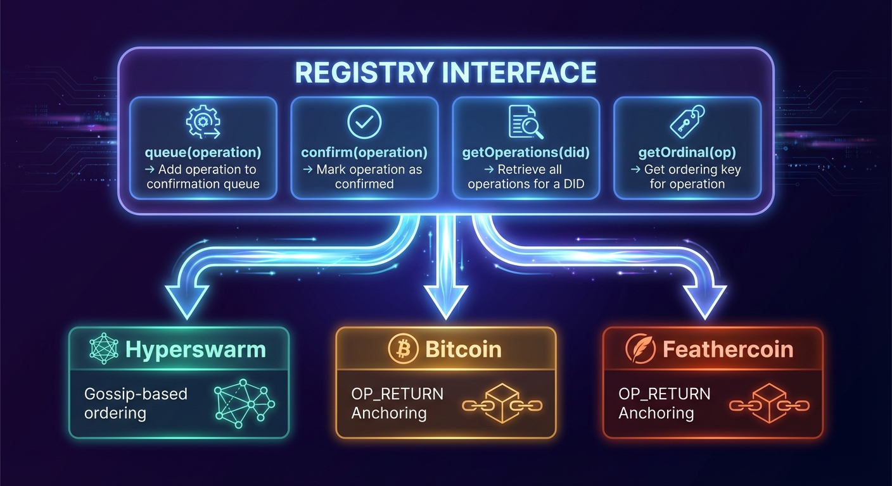

### 7.2 Hyperswarm Registry

The Hyperswarm registry provides fast, peer-to-peer operation distribution:

**Characteristics:**
- Confirmation time: Seconds
- Cost: Zero
- Finality: Eventual consistency (gossip-based)
- Ordering: Timestamp-based with conflict resolution

**Mechanism:**
1. Operations are broadcast to all connected peers
2. Peers validate and store operations locally
3. Ordering determined by timestamp, with cryptographic tiebreakers
4. Eventually consistent across the network

**Best for:** Development, testing, internal organizational use, applications where speed matters more than finality

### 7.3 Blockchain Registries (Satoshi)

Blockchain registries provide cryptographic finality through proof-of-work:

**Bitcoin-family registries**
- Confirmation time: ~60 minutes (6 blocks)
- Cost: variable with network fees
- Finality: Extremely strong (computational security)
- Ordering: Block height + transaction index

**Mechanism:**
1. Operations accumulate in a queue
2. Mediator batches operations and computes batch CID
3. Batch CID embedded in OP_RETURN output (60 bytes)
4. Transaction broadcast and confirmed
5. All nodes can independently verify and import

### 7.4 Blockchain Timestamping

One of Archon's most powerful features is automatic cryptographic timestamping for DID operations registered on block-producing registries. When a DID operation is anchored to Bitcoin, Zcash, Ethereum, Solana, or another blockchain registry, it inherits an immutable, independently verifiable timestamp from the block in which it was confirmed.

#### How Timestamping Works

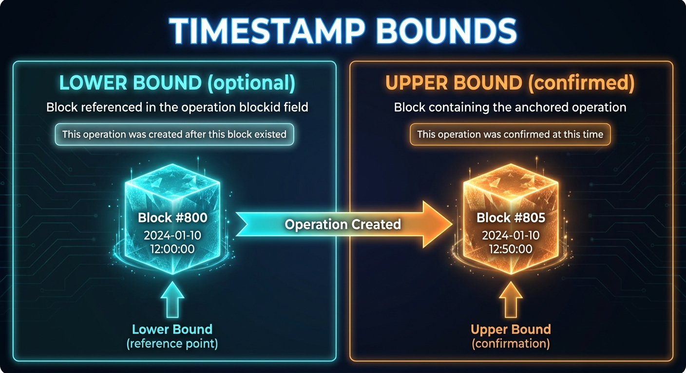

When resolving a DID, the `didDocumentMetadata` includes timestamp information:

```json
{
  "didDocumentMetadata": {
    "created": "2024-01-15T10:30:00Z",
    "updated": "2024-01-16T14:00:00Z",
    "versionId": "bafkrei...",
    "versionSequence": "2",
    "confirmed": true,
    "timestamp": {
      "chain": "BTC:signet",
      "opid": "bafkrei...",
      "lowerBound": {
        "time": 1705312800,
        "timeISO": "2024-01-15T10:00:00Z",
        "blockid": "00000000000000000002a7c4...",
        "height": 826000
      },
      "upperBound": {
        "time": 1705316400,
        "timeISO": "2024-01-15T11:00:00Z",
        "blockid": "00000000000000000001b8f2...",
        "height": 826005,
        "txid": "a1b2c3d4e5f6...",
        "txidx": 42,
        "batchid": "bafkrei...",
        "opidx": 3
      }
    }
  }
}
```

#### Timestamp Components

**Lower Bound** (optional): Created when the operation includes a `blockid` field referencing a recent block at the time of creation. This proves the operation was created *after* that block existed, establishing a "not before" time.

**Upper Bound** (always present for confirmed operations): The block in which the operation batch was anchored. This provides:
- `time`: Unix timestamp of the block
- `timeISO`: Human-readable ISO 8601 format
- `blockid`: The block hash (independently verifiable)
- `height`: Block height in the chain
- `txid`: Transaction ID containing the batch
- `txidx`: Transaction index within the block
- `batchid`: CID of the operation batch
- `opidx`: Index of this operation within the batch

#### Why Blockchain Timestamps Matter

**1. Legal Admissibility**

Blockchain timestamps provide cryptographic proof of existence at a specific time. Unlike self-asserted timestamps, blockchain timestamps are:
- Independently verifiable by any node
- Immutable once confirmed
- Backed by the registry's consensus mechanism
- Anchored to a globally-recognized timechain

This makes them suitable for legal contexts where proving "when" something happened matters:
- Contract signing dates
- Intellectual property registration
- Regulatory compliance timestamps
- Audit trails

**2. Temporal Ordering**

The ordinal key `{block height, transaction index, batch index, operation index}` provides a strict total ordering of all operations, resolving any ambiguity about which operation came first. This is critical for:
- Key rotation (ensuring old keys can't sign "backdated" operations)
- Credential revocation (proving when a credential was revoked)
- Dispute resolution (establishing timeline of events)

**3. Trust Minimization**

Traditional timestamping services require trusting a third party. Blockchain timestamps derive their trustworthiness from:
- Decentralized consensus (no single authority)
- Economic security (cost of attack exceeds benefit)
- Transparent verification (anyone can audit)

**4. Proof of Non-Existence**

The timestamp system also enables proving that something *didn't* exist before a certain time. If an operation's lower bound is block N, it cannot have existed before block N was mined.

#### Timestamp Precision by Registry

| Registry | Typical Precision | Verification |
|----------|-------------------|--------------|
| Bitcoin-family | ~10 minutes (block time) | Full node or SPV proof |
| Zcash | ~75 seconds | Zebra-backed block and transaction checks |
| Ethereum | ~12 seconds | RPC log and block verification |
| Solana | Seconds | RPC signature and block-height verification |
| Hyperswarm | Sub-second (self-asserted) | Peer attestation only |

#### Use Cases for Timestamps

**Intellectual Property**: Prove when a creative work was first registered, establishing priority for copyright or patent claims.

**Credential Validity Windows**: Verify that a credential was issued before its expiration date and hadn't been revoked at the time of use.

**Audit Compliance**: Demonstrate that required attestations or certifications were in place at specific regulatory checkpoints.

**Legal Evidence**: Provide court-admissible proof of when digital agreements, signatures, or declarations were made.

**Version Control**: Establish authoritative ordering of document revisions or identity updates, preventing "time-warp" attacks.

---

## 8. Advanced Features

Beyond the core DID functionality, Archon includes several advanced features that extend the protocol into a comprehensive identity and communication platform.

### 8.1 Time-Travel Resolution

Archon supports resolving DIDs at any point in their history, enabling powerful audit and compliance capabilities.

**Resolution Options:**

```javascript
// Resolve at a specific point in time
resolveDID(did, { versionTime: "2024-01-15T10:00:00Z" })

// Resolve a specific version number
resolveDID(did, { versionSequence: 3 })

// Verify operation proofs while resolving
resolveDID(did, { verify: true })
```

**How It Works:**

Every DID operation includes a `previd` field linking to the previous operation, creating an immutable chain:

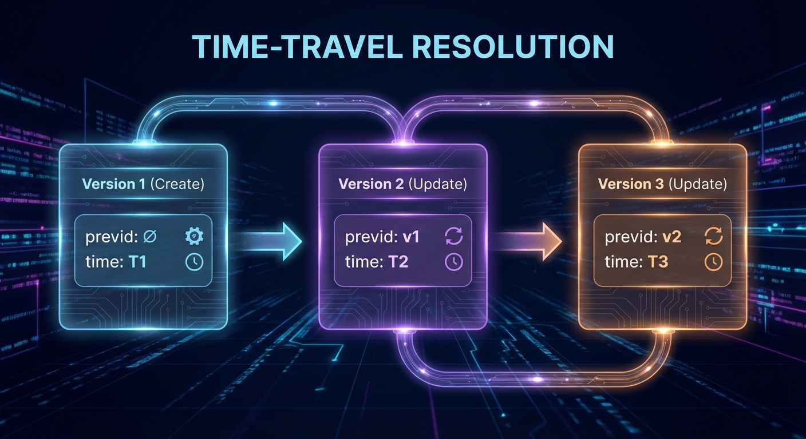

The resolver walks this chain, applying operations up to the requested time/version, then returns the reconstructed document state.

**Use Cases:**
- **Audit trails**: Prove what credentials existed at a specific regulatory checkpoint
- **Dispute resolution**: Establish the state of an identity at a contested point in time
- **Recovery**: Examine historical states to understand how a DID evolved
- **Compliance**: Demonstrate historical compliance at any point

### 8.2 Decentralized Messaging (D-Mail)

Archon includes a complete decentralized email system built on top of the DID infrastructure:

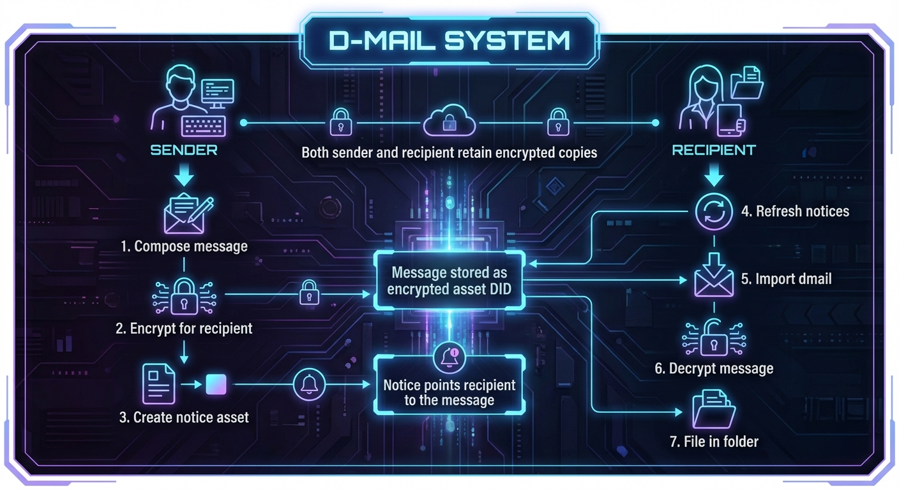

**Features:**
- **Folder organization**: INBOX, SENT, DRAFT, ARCHIVED, DELETED
- **CC support**: Multiple recipients with individual encryption
- **Attachments**: Files stored as asset DIDs
- **Read tracking**: UNREAD tag for new messages
- **Dual encryption**: Both sender and recipient can decrypt

**Message Structure:**
```json
{
  "didDocumentData": {
    "dmail": {
      "from": "did:cid:bafkrei...alice",
      "to": ["did:cid:bafkrei...bob"],
      "cc": ["did:cid:bafkrei...carol"],
      "subject": "Meeting Tomorrow",
      "body": "encrypted-content...",
      "attachments": ["did:cid:bafkrei...file1"],
      "created": "2024-01-15T10:30:00Z"
    }
  }
}
```

### 8.3 Privacy-Preserving Voting

Archon's polling system goes beyond simple vote counting to provide cryptographic privacy guarantees:

**Two-Phase Voting Protocol:**

```
Phase 1: Ballot Collection (Private)
──────────────────────────────────────
• Voters cast encrypted ballots
• Ballots stored as asset DIDs
• Vote choices hidden from everyone
• Eligibility verified via credentials

Phase 2: Result Revelation (Optional)
──────────────────────────────────────
• Poll creator can reveal results
• Individual ballots can remain hidden
• Or full transparency with ballot publication
```

**Privacy Features:**

1. **Spoil Ballots**: Voters can cast intentionally invalid ballots that are indistinguishable from valid ones, providing plausible deniability about whether they voted.

2. **Hidden Results**: Poll creators can choose to keep results hidden until a deadline or indefinitely.

3. **Anonymous Tallying**: Results can be published without revealing individual votes.

**Poll Structure:**
```json
{
  "didDocumentData": {
    "poll": {
      "question": "Approve the Q4 budget?",
      "options": ["Yes", "No", "Abstain"],
      "deadline": "2024-02-01T00:00:00Z",
      "roster": "did:cid:bafkrei...eligible-voters",
      "resultsHidden": true,
      "ballots": {
        "did:cid:bafkrei...ballot1": "encrypted...",
        "did:cid:bafkrei...ballot2": "encrypted..."
      }
    }
  }
}
```

### 8.4 Vaults with Secret Membership

Archon supports multi-party encrypted storage where members can share data without necessarily knowing each other's identities:

**Standard Group:**
```json
{
  "didDocumentData": {
    "group": {
      "name": "Project Alpha Team",
      "members": [
        "did:cid:bafkrei...alice",
        "did:cid:bafkrei...bob"
      ],
      "vault": "did:cid:bafkrei...shared-vault"
    }
  }
}
```

**Secret Member Group:**
```json
{
  "didDocumentData": {
    "group": {
      "name": "Anonymous Review Board",
      "secretMembers": true,
      "encryptedMembers": "encrypted-member-list...",
      "vault": "did:cid:bafkrei...shared-vault"
    }
  }
}
```

**How Secret Membership Works:**

1. **Encrypted Member List**: The member list is encrypted so only the group controller knows all members
2. **Individual Access Keys**: Each member receives their own derived key to access the vault
3. **Plausible Membership**: Members cannot prove or disprove others' membership
4. **Anonymous Contributions**: Items added to the vault don't reveal the contributor

**Use Cases:**
- **Whistleblower systems**: Submit documents without revealing identity to other submitters
- **Blind review**: Academic or professional review where reviewers don't know each other
- **Anonymous committees**: Voting bodies where member composition is confidential

### 8.5 Challenge-Response Authentication

Archon provides a flexible challenge-response system for authentication and authorization:

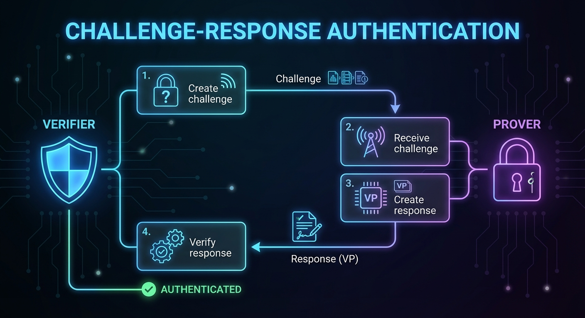

**Challenge Types:**

1. **Simple Identity Challenge**: Prove you control a specific DID
2. **Credential Challenge**: Prove you hold a credential of a specific type
3. **Issuer-Specific Challenge**: Prove you hold a credential from a specific issuer

**Challenge Structure:**
```json
{
  "type": "VerifiablePresentation",
  "challenge": "random-nonce-12345",
  "domain": "https://example.com",
  "credentialRequirements": [
    {
      "type": "EmployeeCredential",
      "issuers": ["did:cid:bafkrei...acme-corp"]
    }
  ]
}
```

**Response (Verifiable Presentation):**
```json
{
  "type": "VerifiablePresentation",
  "holder": "did:cid:bafkrei...alice",
  "challenge": "random-nonce-12345",
  "verifiableCredential": [
    { /* Matching credential */ }
  ],
  "proof": { /* Signature over presentation */ }
}
```

### 8.6 Lightning Payments

Archon integrates with the Bitcoin Lightning Network to enable instant, low-cost payments between DIDs. By binding Lightning capabilities directly to decentralized identities, Archon creates a payment layer where any DID holder can send and receive satoshis without revealing personal information.

#### Publishing Lightning Capability

An agent publishes its Lightning receiving capability by registering an invoice key with a Drawbridge gateway and adding a `#lightning` service entry to its DID document:

```json
{
  "didDocument": {
    "service": [
      {
        "id": "#lightning",
        "type": "LightningService",
        "serviceEndpoint": "https://drawbridge.example.com"
      }
    ]
  }
}
```

Any party resolving the DID can discover the Lightning endpoint and initiate a payment without prior coordination.

#### Zap Protocol

The [Archon "zap" protocol](lightning-zap-sequence.md) enables sending satoshis to any DID, alias, or LUD-16 Lightning Address:

```
zap <recipient> <amount_sats> [memo]
```

**DID/Alias Flow:**
1. Keymaster resolves the recipient alias or DID, loads the sender's LNbits admin key from the wallet, and delegates to Drawbridge (`POST /lightning/zap`)
2. Drawbridge resolves the recipient DID via Gatekeeper to locate the `#lightning` service endpoint
3. Drawbridge requests a BOLT11 invoice from the recipient's Lightning service (`.onion` endpoints are proxied via Tor; clearnet endpoints require HTTPS with SSRF protection)
4. Drawbridge pays the invoice through the sender's LNbits instance, which routes the payment across the Lightning Network

**LUD-16 Address Flow (user@domain):**
1. Keymaster detects the `@` in the recipient string and delegates to Drawbridge
2. Drawbridge fetches `https://domain/.well-known/lnurlp/user` for the LNURL-pay metadata (SSRF-protected)
3. Drawbridge requests a BOLT11 invoice from the callback URL with the amount in millisatoshis
4. Drawbridge pays the invoice through the sender's LNbits instance

Both flows return a `paymentHash` to the caller for tracking. This unified interface abstracts away the differences between DID-native Lightning endpoints and standard LNURL/Lightning Address recipients.

#### Payment Tracking

All Lightning payments are recorded with full lifecycle tracking:

```json
{
  "paymentHash": "a1b2c3...",
  "bolt11": "lnbc...",
  "amount": 1000,
  "memo": "Thanks for the article",
  "status": "settled",
  "preimage": "d4e5f6...",
  "expiry": "2024-01-15T11:30:00Z"
}
```

Payments transition through states: **pending** → **settled** | **failed** | **expired**, providing clear visibility into payment outcomes.

### 8.7 L402 API Gateway

Drawbridge implements the L402 protocol (formerly LSAT) to enable machine-readable, pay-per-use access to API endpoints. L402 combines HTTP 402 (Payment Required) status codes with Lightning invoices and macaroon-based authentication tokens.

#### How L402 Works

1. Client requests a protected resource (any proxied Gatekeeper or Keymaster endpoint)
2. Drawbridge returns HTTP 402 with a macaroon (containing caveats for scope, expiry, and payment hash) and a BOLT11 Lightning invoice
3. Client pays the invoice through the Lightning Network, receiving a preimage as proof of payment
4. Client re-requests the resource with `Authorization: L402 <macaroon>:<preimage>`
5. Drawbridge verifies the preimage cryptographically (`SHA256(preimage) == paymentHash`) and validates the macaroon's HMAC chain and caveats, then grants access

#### API Monetization

L402 enables fine-grained monetization of identity services:

- **Per-request pricing**: Each API call requires a micro-payment
- **Subscription tiers**: Authenticated users bypass L402 for included quotas
- **Hybrid auth**: Combine traditional API keys with Lightning fallback
- **No accounts required**: Anonymous, permissionless access via payment alone

This allows Archon node operators to offer public DID resolution, credential verification, and other services as paid APIs without requiring user registration or payment processors.

### 8.8 Key Rotation

Archon supports secure key rotation without changing the DID:

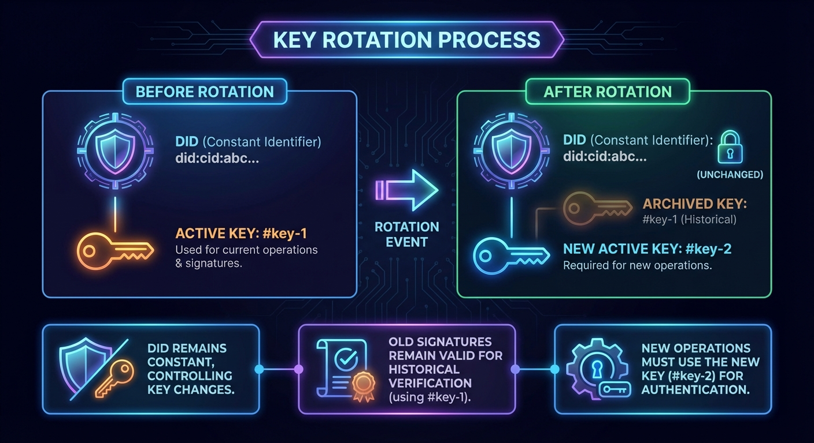

**Security Properties:**
- Old keys cannot sign new operations (enforced by `previd` chain)
- Historical signatures remain verifiable
- Compromised keys can be rotated without losing identity
- Key rotation is itself timestamped on blockchain registries

### 8.9 DIDComm v2 Messaging

D-Mail (§8.2) is Archon-native: it works beautifully between Archon identities and not at all with anything else. DIDComm v2 is the interoperability layer — a DIF standard for confidential, optionally sender-authenticated, transport-agnostic messaging between DIDs that publish compatible key-agreement material. Archon implements it as an additive capability; DIDComm does not replace D-Mail.

#### The secp256k1 constraint

Archon's signing keys are secp256k1, which is not a key-agreement curve DIDComm implementations support. Rather than change the identity key, Archon derives a separate **X25519** key-agreement key deterministically from the existing wallet seed at a distinct key index. It therefore needs no separate backup — recovering the wallet recovers the messaging key — and it is published in the DID document as a `keyAgreement` verification method.

#### Envelope construction

The envelope crypto is implemented in pure JavaScript in `@didcid/cipher`, extending the ECDH-ES and JWE machinery already used for `encryptMessage`. Pure JS (rather than a WASM library) is a deliberate choice: the primary target is in-browser self-custody wallets, which hold keys locally and must therefore pack and unpack client-side, with no bundler-specific WASM wiring or relaxed CSP.

```
JWM plaintext  →  optional JWS (ES256K)  →  JWE   (key wrap: A256KW)
                                            ├─ anoncrypt: ECDH-ES   + XC20P
                                            └─ authcrypt: ECDH-1PU  + A256CBC-HS512
```

The content cipher shown on each branch is the default; callers may select `A256CBC-HS512`, `XC20P`, or `A256GCM` explicitly.

Responsibilities follow the existing `cipher` ↔ `keymaster` split: `cipher` operates on raw JWKs and knows nothing of DIDs or wallets; `keymaster` resolves the recipient DID to its `keyAgreement` key, derives the sender's own keys, and on unpack resolves the *sender's* DID to verify authcrypt or the JWS signature. Private keys never leave the process holding the wallet — in a browser wallet, that is the browser.

Spec compliance was originally established by interoperability testing against the reference `didcomm-node` implementation, used strictly as a development oracle and never shipped as a runtime dependency. That oracle has since been removed from the repository. Ongoing regression coverage rests on local round trips and on committed TypeScript envelope fixtures that the Python implementation must decrypt, which pins cross-language agreement without carrying a reference implementation as a test dependency.

#### Supported protocols

| Protocol | Version |
|---|---|
| Trust Ping | 2.0 |
| Basic Message | 2.0 |
| Discover Features | 2.0 |
| Out-of-Band Invitation | 2.0 |
| Issue Credential | 3.0 |
| Present Proof | 3.0 |
| Coordinate Mediation | 2.0 |

Issue Credential and Present Proof bridge DIDComm to Archon's Verifiable Credentials layer (§9), letting an Archon identity issue to, or prove to, a non-Archon agent over a standard protocol. Coordinate Mediation lets an identity without a stable public endpoint receive through a mediator, with forwarded envelopes wrapped for the mediator's routing key.

#### Transport and privacy

Message crypto lives in the wallet; *delivery* is owned by the DIDComm service. Outbound sends are handed to that service over an authenticated challenge-response proving control of the sender DID, and the service delivers the opaque envelope onward. This split exists for privacy: it lets egress traverse Tor without exposing the wallet's host, and it means the transport component handles only ciphertext it cannot read.

An identity advertises its capability by publishing a `DIDCommMessaging` service entry to its DID document, which auto-discovers the node's public endpoint — preferring a configured public host, falling back to the node's Tor onion address, and otherwise publishing key material only.

#### Mailbox and retrieval

Inbound messages are **not pushed to wallets**. The service acts as a store-and-forward relay: a sender deposits an envelope, the service files it into a per-identity mailbox, and it stays there until the key-holder collects it.

```
sender ──POST envelope──▶ relay ──▶ mailbox (per recipient DID)
                                        │
wallet ──challenge──▶ relay             │  envelope at rest, encrypted
wallet ──fetch (signed)──────────────▶ ─┘  ──▶ unpack locally
wallet ──remove (signed)──────────────▶  discard acknowledged ids
```

Envelopes are addressed by parsing the recipient DIDs out of the JWE recipient key identifiers, so the relay routes without opening anything. Retrieval is a deliberate two-step: the wallet fetches its queued envelopes, unpacks them locally, and only then acknowledges the ones that unpacked successfully, which removes them. A message that fails to unpack is therefore not discarded on that attempt — it stays queued for retry until it is acknowledged, reaches the retention deadline, or its store is lost (the default in-memory backend holds mailboxes in process memory and does not survive a restart). Both fetch and remove require a single-use challenge, signed by the identity's key, that expires in five minutes and is consumed on use to prevent replay.

Retention of undelivered envelopes is bounded at seven days, but that bound is a property of the storage backend rather than of the protocol: it holds only where the backend enforces expiry independently of access. The mailbox is pluggable — an in-memory store by default, or Redis, which enforces the window through native key expiry. A deployment relying on the retention bound, or on envelopes surviving a restart, should choose its backend accordingly. Current per-backend conformance to this bound is recorded with the reference implementation rather than here.

This pull model is what makes self-custody practical. A browser extension, a mobile wallet, or a laptop behind NAT has no stable inbound endpoint and is offline most of the time; requiring one would concede either constant availability or key custody. Instead the wallet reaches out when it is running, and the private keys never leave it.

The design is deliberately minimal in what it trusts the relay with, but it is not metadata-free, and it is worth being precise about the residual exposure. The relay cannot read message content, and cannot forge an *authenticated* message or impersonate an authenticated sender. It can do rather more than that phrasing might suggest.

Deposit is unauthenticated by design — a sender must be able to reach a stranger's mailbox — so anyone who can resolve a recipient's public key, the relay included, can construct a valid anoncrypt envelope and inject it. Anoncrypt carries no sender identity, so there is nothing to authenticate and nothing to forge. Recipients should treat an unauthenticated envelope as exactly that: the guarantee attaches to authcrypt and to the JWS signature layer, not to delivery. On the normal authcrypt path the sender's DID URL travels in the visible protected `skid` header, readable without decryption, and the outbound relay additionally authenticates the sender DID at hand-off — so the relay learns **who is talking to whom**, not merely who is receiving. It also observes recipient key identifiers, the timing and volume of both deposits and collections, and it holds ciphertext at rest for up to the retention window.

An adversary running the relay therefore reconstructs a social graph and a communication pattern even though every message stays sealed. Anoncrypt omits `skid` and so withholds the sender from the envelope itself, though the delivery hand-off still identifies the sender to its own relay. Identities for whom that pattern is sensitive should run their own relay, reach it over Tor, or receive through a mediator rather than a directly published endpoint.

DIDComm is available across every Archon surface: the Keymaster library, REST API, client, and CLI; the MCP server; the Python SDK; and a full pure-Python implementation of the envelope crypto in the Python keymaster library.

---

## 9. Verifiable Credentials

### 9.1 W3C Verifiable Credentials Support

Archon implements the full W3C Verifiable Credentials Data Model:

```json
{
  "@context": [
    "https://www.w3.org/2018/credentials/v1"
  ],
  "type": ["VerifiableCredential", "UniversityDegreeCredential"],
  "issuer": "did:cid:bafkrei...",
  "issuanceDate": "2024-01-15T00:00:00Z",
  "credentialSubject": {
    "id": "did:cid:bafkrei...",
    "degree": {
      "type": "BachelorDegree",
      "name": "Bachelor of Science"
    }
  },
  "proof": {
    "type": "EcdsaSecp256k1Signature2019",
    "created": "2024-01-15T00:00:00Z",
    "verificationMethod": "did:cid:bafkrei...#key-1",
    "proofPurpose": "assertionMethod",
    "proofValue": "..."
  }
}
```

### 9.2 Credential Lifecycle

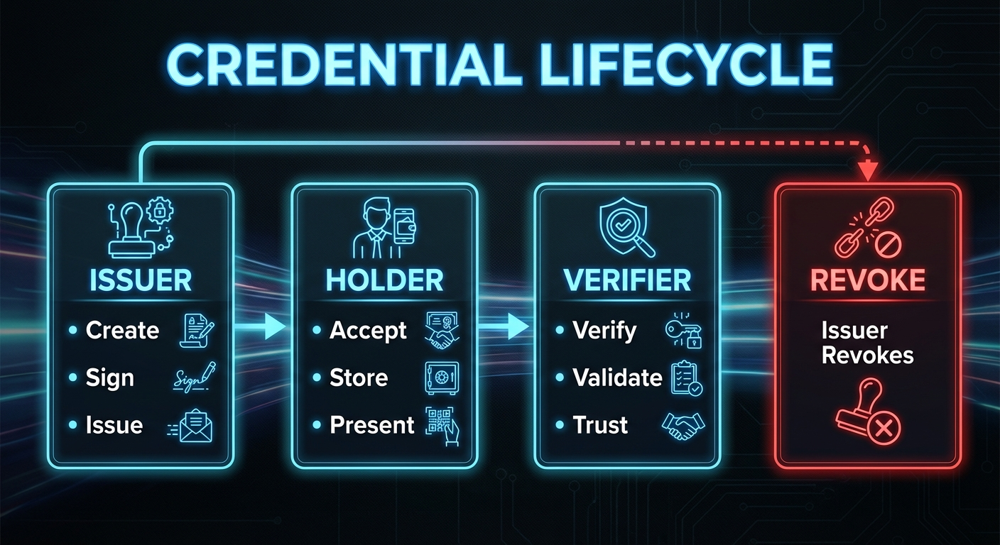

### 9.3 Privacy Features

**Encryption**
- Credentials can be encrypted for specific recipients
- Only the intended holder can decrypt and access
- Recipient confidentiality: a presentation encrypts the complete signed credential for a chosen verifier, so third parties learn nothing. This is confidentiality of the whole credential, **not** claim-level selective disclosure — the verifier receives every claim in it. Disclosing individual claims requires the salted-hash mechanism described in §14.1, which is not yet implemented.

**Bound Credentials**
- Credentials can be cryptographically bound to subjects
- Prevents credential transfer between identities
- Verifiers can confirm binding integrity

---

## 10. Cryptographic Foundation

### 10.1 Key Management

**Hierarchical Deterministic Wallets (BIP-32)**
```
Master Seed (BIP-39 Mnemonic)
        │
        ├── m/44'/0'/0'  (Bitcoin keys)
        ├── m/84'/0'/0'  (Native SegWit)
        ├── m/86'/0'/0'  (Taproot)
        └── m/390'/0'/0' (DID signing keys)
                  │
                  ├── Identity 1
                  ├── Identity 2
                  └── Identity N
```

**Key Types:**
- **ECDSA secp256k1**: Primary signing algorithm
- **JWK format**: Standardized key representation
- **AES-256-GCM**: Symmetric encryption for at-rest protection

### 10.2 Signature Scheme

All operations are signed using ECDSA over secp256k1:

```
signature = ECDSA_sign(
  private_key,
  SHA256(canonical_json(operation))
)
```

Verification:
```
valid = ECDSA_verify(
  public_key,
  SHA256(canonical_json(operation)),
  signature
)
```

### 10.3 Content Addressing

DIDs are derived from content addresses:

```
operation = create_operation(public_key, registry, ...)
canonical = json_canonicalize(operation)
cid = IPFS_add(canonical)  # CIDv1, base32
did = "did:cid:" + cid
```

This creates a self-certifying identifier: the DID itself proves the integrity of the creation operation.

---

## 11. Network Topology

### 11.1 Node Types

**Full Nodes**
- Run complete Gatekeeper with local database
- Participate in all supported registries
- Validate and store all operations
- Provide resolution services

**Light Clients**
- Connect to trusted full nodes
- Perform wallet operations locally
- Delegate resolution to full nodes
- Suitable for browsers and mobile

**Registry Nodes**
- Specialized mediator nodes
- Focus on specific registry synchronization
- May run blockchain full nodes

**Tor Hidden Service Nodes**
- Expose Drawbridge API as a `.onion` address
- Enable fully anonymous identity operations
- Protect both client and server network identity
- Particularly relevant for censorship-resistant use cases

### 11.2 Peer Discovery

**Hyperswarm DHT**
- Nodes announce presence on topic-based DHT
- Peers discover each other without central coordination
- Encrypted connections established via noise protocol

**IPFS Network**
- Content retrieval via IPFS libp2p
- Global availability of DID operations
- No single point of failure for content access

### 11.3 Synchronization

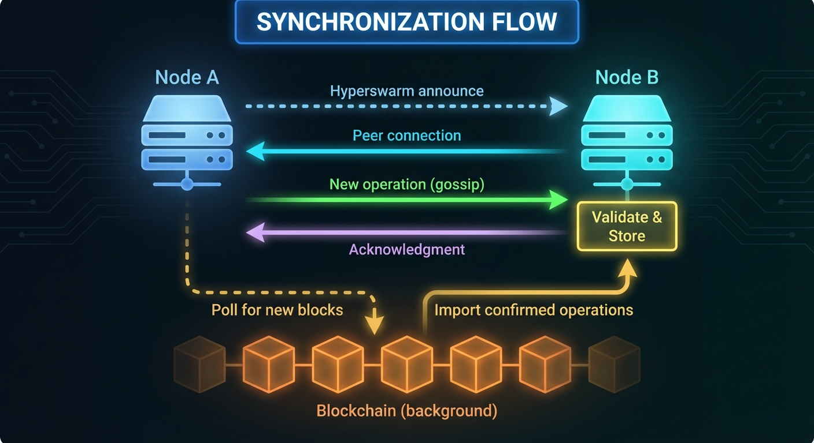

---

## 12. Use Cases

### 12.1 Self-Sovereign Identity

Individuals create and control their own digital identities without relying on any central authority:

- Generate identity locally using Keymaster
- Choose appropriate registry based on needs
- Hold credentials from multiple issuers
- Choose which credentials to present to which verifier, each presentation encrypted for its recipient (whole-credential, not claim-level — see §9.3)
- Recover identity using mnemonic seed phrase

### 12.2 Enterprise Identity Management

Organizations deploy Archon for decentralized employee and partner identity:

- Issue employee credentials upon onboarding
- Revoke credentials upon termination
- Enable passwordless authentication
- Audit credential usage and access

### 12.3 Educational Credentials

Universities and certification bodies issue verifiable credentials:

- Degrees and diplomas as verifiable credentials
- Professional certifications with expiration
- Micro-credentials for specific skills
- Instant verification by employers

### 12.4 IoT Device Identity

Connected devices receive unique, verifiable identities:

- Device attestation through manufacturer credentials
- Secure device-to-device authentication
- Supply chain provenance tracking
- Firmware update verification

### 12.5 Voting and Governance

Organizations implement transparent voting systems:

- Anonymous ballot casting
- Verifiable vote counting
- Proof of eligibility without identity disclosure
- Auditable election results

### 12.6 Micropayments and API Monetization

Node operators monetize identity services using Lightning micropayments:

- DID resolution as a paid service (fractions of a cent per query)
- Credential verification APIs with per-request pricing
- Anonymous API access without accounts or payment processors
- Content creators receive tips and zaps directly to their DID
- Machine-to-machine payments for automated identity workflows

### 12.7 Digital Asset Provenance

Track ownership and authenticity of digital assets:

- Digital art authentication
- Document signing and notarization
- Supply chain tracking
- Intellectual property registration

### 12.8 AI Agents

Autonomous and semi-autonomous AI agents need durable identities, scoped authority, and auditable action histories:

- Assign each agent a DID with verifiable keys, service endpoints, and owner/controller metadata
- Issue credentials for capabilities, model provenance, organization membership, and delegated authority
- Authorize actions through challenge-response flows instead of long-lived shared secrets
- Record important decisions, tool invocations, and policy updates as signed DID-linked assets
- Use Lightning payments and L402 for agent-to-agent service calls, paid API access, and metered compute
- Rotate or revoke compromised agent keys without losing the agent's identity history

Archon meets agents where they already are, through two standard protocols:

**Model Context Protocol (MCP).** The `@didcid/mcp-server` package exposes the Keymaster surface — identities, credentials, aliases, addresses, groups, vaults, assets, polls, D-Mail, Lightning, and DIDComm — as typed MCP tools with JSON Schema inputs. It runs as a local stdio server against the user's own wallet, so the agent gains the *use* of an identity — signing, issuing, resolving. The server itself never uploads the wallet file or passphrase anywhere; stdio bounds only the hop between the server and its MCP host. It does not bound what happens next. As detailed in §4.2, several tools return the decrypted wallet, and `archon_create_wallet` does so with no gating argument at all; a host backed by a remote model will forward that serialized `WalletFile` to the model like any other tool result. Whether wallet material leaves the machine is therefore a property of the MCP host and the exposed-tool policy, not of this server. Restricting which tools are exposed is the only real boundary. Large assets are returned as linked resources rather than inlined, keeping context windows small.

**DIDComm v2 (§8.9).** Where MCP connects an agent to its *own* identity, DIDComm connects two agents to *each other*: confidential, optionally sender-authenticated messaging — authcrypt binds the sender, anoncrypt does not — including credential issuance and proof presentation over standard protocols. This works with any DID that resolves to a compatible X25519 `keyAgreement` key, which is the interoperability limit worth naming: the counterparty need run no Archon software, but a DID lacking published X25519 key-agreement material cannot be reached. Within that constraint, an agent can prove a delegated capability to an entirely foreign implementation.

---

## 13. Comparison with Existing Solutions

### 13.1 Feature Comparison

| Feature | did:cid (Archon) | did:btc | did:web | did:key |
|---------|------------------|---------|---------|---------|
| Creation Cost | Free | ~$1-10 | Free | Free |
| Creation Speed | Instant | Minutes | Instant | Instant |
| Update Support | Yes | Yes | Yes | No |
| Decentralized | Full | Full | Partial | Full |
| Finality Options | Multiple | Strong | None | N/A |
| Credential Support | Full | Limited | Full | Limited |
| Key Recovery | BIP-39 | Varies | N/A | N/A |
| Arbitrary Data Storage | Yes (didDocumentData) | No | External only | No |
| Blockchain Timestamps | Automatic (with bounds) | Implicit | No | No |
| Time-Travel Resolution | Yes | No | No | No |
| Built-in Messaging | Yes (D-Mail) | No | No | No |
| Lightning Payments | Yes (L402 + Zaps) | No | No | No |
| API Monetization | Yes (L402) | No | No | No |
| Tor Hidden Services | Yes | No | No | No |
| Voting/Governance | Yes | No | No | No |

### 13.2 Architectural Comparison

**did:btc**
- Anchors DID state directly to Bitcoin transactions
- Strong finality but creation and updates inherit Bitcoin fee and confirmation constraints
- Best suited to identities that need direct Bitcoin-level anchoring

**did:ion**
- Uses the Sidetree protocol to batch many DID operations into periodic Bitcoin anchors
- Reduces per-operation chain cost compared with direct on-chain methods
- Still depends on Bitcoin anchor cadence for finality

**did:web**
- Relies on DNS and HTTPS
- Centralized at the domain level
- No inherent finality or ordering

**did:key**
- Simple, deterministic from public key
- No update capability
- Limited to ephemeral use cases

**did:cid (Archon)**
- Free, instant creation via IPFS
- Optional blockchain finality for updates
- Best of both worlds approach

---

## 14. Future Directions

### 14.1 Protocol Evolution

**Multi-Signature Support**
- Threshold signatures for organizational control
- Social recovery mechanisms
- Escrow and time-locked operations

**Selective Disclosure**
- Salted-hash selective disclosure following RFC 9901 (SD-JWT), letting a holder reveal individual credential claims while the issuer's signature still covers the whole
- Holder key binding at presentation, so a disclosed credential cannot be replayed by a third party
- Zero-knowledge proofs for the cases salted hashes cannot cover: predicate proofs (age over a threshold without the birth date) and unlinkable multi-presentation

**Cross-Chain Bridges**
- Registry migration between blockchains
- Interoperability with other DID methods
- Federated identity across networks

### 14.2 Ecosystem Development

**Schema Registry**
- Standardized credential schemas
- Industry-specific schema packages
- Automated schema validation

**Trust Frameworks**
- Governance frameworks for issuer accreditation
- Trust registries for verifier policies
- **Scoped recognition** rather than global reputation: a trust edge issued as a credential carrying a domain, a confidence, and a bounded delegation depth that attenuates at each hop. Each identity evaluates trust through its own recognitions, so there is no pooled reputation score and no central authority over standing.

### 14.3 Performance Optimization

**Layer 2 Scaling**
- Batching and rollup techniques
- State channels for high-frequency updates
- Optimistic confirmation with dispute resolution

---

## 15. Conclusion

Archon represents a significant advancement in decentralized identity technology. By separating identity creation from updates and supporting multiple registry options, it solves the fundamental tension between decentralization, cost, and speed that has limited previous approaches.

Key innovations include:

1. **Zero-cost, instant identity creation** through IPFS content addressing
2. **Flexible finality options** via multi-registry architecture
3. **The didDocumentData extension** enabling arbitrary application data bound to identities
4. **Automatic blockchain timestamping** providing cryptographic proof of when operations occurred
5. **Time-travel resolution** allowing DIDs to be resolved at any point in their history
6. **Decentralized messaging (D-Mail)** built on the identity layer
7. **DIDComm v2 messaging** providing confidential, standards-based interoperability with non-Archon agents
8. **Lightning Network integration** enabling instant DID-to-DID payments and zaps
9. **L402 API monetization** allowing node operators to offer paid identity services without accounts
10. **Encrypted ballot collection** with spoil ballots and two-phase revelation. Ballots are encrypted in storage and results can be published without them, but the poll organizer decrypts each ballot and holds a ballot-key-to-member mapping, so choices are linkable to voters by the organizer. This is confidentiality from third parties, not voter anonymity from the organizer.
11. **Vaults with secret membership** for anonymous collaboration
12. **Tor hidden service support** for censorship-resistant access, hiding network location from the service and from passive network observers. This is privacy-enhancing, not an anonymity guarantee — traffic-correlation attacks and application-level metadata such as DIDs presented in a session remain outside its threat model.
13. **Interoperable DID resolution** at `/1.0/identifiers`, served by two independent implementations
14. **An MCP server** letting AI agents operate an identity from a locally held wallet
15. **Comprehensive credential support** for real-world applications

Implementation status: the protocol is implemented across multiple clients (CLI, web, mobile, browser extension), a Lightning-enabled API gateway (Drawbridge), a DIDComm v2 messaging service, an MCP server for AI agents, and a Python SDK, with two independent Gatekeeper implementations in TypeScript and Rust. This paper does not present a formal threat model, a security proof, a conformance matrix, or benchmarks, and the suitability of Archon for a given deployment should be assessed against that gap rather than inferred from this description.

As the digital identity landscape continues to evolve, Archon's modular architecture positions it to adapt to new requirements while maintaining backward compatibility and the core principles of user sovereignty and decentralization.

---

## References

1. W3C Decentralized Identifiers (DIDs) v1.0. https://www.w3.org/TR/did-core/
2. W3C Verifiable Credentials Data Model v1.1. https://www.w3.org/TR/2022/REC-vc-data-model-20220303/
3. IPFS Content Identifiers (CIDs). https://docs.ipfs.tech/concepts/content-addressing/
4. BIP-32: Hierarchical Deterministic Wallets. https://github.com/bitcoin/bips/blob/master/bip-0032.mediawiki
5. BIP-39: Mnemonic code for generating deterministic keys. https://github.com/bitcoin/bips/blob/master/bip-0039.mediawiki
6. Hyperswarm Protocol. https://docs.holepunch.to/building-blocks/hyperswarm
7. JSON Canonicalization Scheme (JCS). RFC 8785
8. DIDComm Messaging v2.1. Decentralized Identity Foundation. https://identity.foundation/didcomm-messaging/spec/v2.1/
9. Public Key Authenticated Encryption for JOSE: ECDH-1PU. draft-madden-jose-ecdh-1pu
10. Model Context Protocol. https://modelcontextprotocol.io/
11. Selective Disclosure for JSON Web Tokens (SD-JWT). RFC 9901

---

## Appendix A: Quick Start

### Creating Your First Identity

```bash
# Initialize wallet with new seed phrase
./archon create-wallet

# Create a new identity
./archon create-id alice

# Resolve the current identity
./archon resolve-id

# Back up wallet to file
./archon backup-wallet-file wallet-backup.json
```

---

*Copyright 2026 Archetech. Released under MIT License.*
