# Archon: A Decentralized Identity Protocol

## White Paper v1.2

**Abstract**

Archon is a decentralized identity (DID) protocol implementing the W3C-compliant `did:cid` scheme. It provides a comprehensive peer-to-peer identity infrastructure that enables secure, verifiable decentralized identities anchored to IPFS and multiple blockchain registries. By separating DID creation (via content-addressable storage) from DID updates (via distributed registries), Archon achieves the unprecedented combination of instant, zero-cost identity creation with cryptographically secure, consensus-driven updates.

---

## Table of Contents

1. [Introduction](#1-introduction)
2. [Problem Statement](#2-problem-statement)
3. [The Archon Solution](#3-the-archon-solution)
4. [Technical Architecture](#4-technical-architecture)
5. [The did:cid Method](#5-the-didcid-method)
6. [The didDocumentData Extension](#6-the-diddocumentdata-extension)
7. [Registry System](#7-registry-system)
8. [Advanced Features](#8-advanced-features)
9. [Verifiable Credentials](#9-verifiable-credentials)
10. [Cryptographic Foundation](#10-cryptographic-foundation)
11. [Network Topology](#11-network-topology)
12. [Use Cases](#12-use-cases)
13. [Comparison with Existing Solutions](#13-comparison-with-existing-solutions)
14. [Future Directions](#14-future-directions)
15. [Conclusion](#15-conclusion)

---

## 1. Introduction

The digital age has created an identity paradox. While individuals generate more personal data than ever before, control over that data has concentrated in the hands of a few large platforms. Traditional identity systems—whether government-issued, corporate-managed, or platform-specific—share fundamental limitations: centralized control, single points of failure, and the inability to provide true user sovereignty.

Decentralized Identifiers (DIDs), as specified by the World Wide Web Consortium (W3C), offer a path forward. DIDs are globally unique identifiers that enable verifiable, decentralized digital identity without requiring a centralized registry. However, existing DID implementations face practical challenges: blockchain-based methods incur transaction costs and confirmation delays, while purely peer-to-peer approaches lack the finality guarantees required for high-stakes applications.

Archon addresses these challenges through a novel architectural approach that separates identity creation from identity updates, achieving both instant availability and cryptographic finality through its multi-registry design.

---

## 2. Problem Statement

### 2.1 The Centralization Problem

Current digital identity systems concentrate authority in centralized entities. Whether a government agency, a social media platform, or an enterprise identity provider, these systems create:

- **Single points of failure**: Service outages or organization failures can invalidate identities
- **Privacy vulnerabilities**: Centralized databases become attractive targets for attackers
- **Censorship risks**: Central authorities can revoke identities without recourse
- **Vendor lock-in**: Users cannot port their identity between systems

### 2.2 The Blockchain Trilemma for Identity

Existing blockchain-based DID methods face a trilemma between:

1. **Cost**: On-chain operations require transaction fees, making identity creation economically infeasible for many use cases
2. **Speed**: Blockchain confirmation times (minutes to hours) create unacceptable latency for real-time applications
3. **Decentralization**: Solutions that address cost and speed often compromise on decentralization

### 2.3 The Verification Gap

Even when decentralized identities exist, verifying them requires:

- Access to the same network infrastructure
- Trust in the resolution mechanism
- Ability to validate cryptographic proofs

Many existing systems fail to provide portable, universally verifiable identity documents.

---

## 3. The Archon Solution

### 3.1 Core Innovation: Separation of Creation and Updates

Archon's fundamental insight is that DID creation and DID updates have fundamentally different requirements:

**Creation** requires:
- Speed (immediate availability)
- Low or no registry fee (enabling mass adoption)
- Decentralization (no gatekeepers)

**Updates** require:
- Ordering guarantees (prevent replay attacks)
- Finality (irreversible once confirmed)
- Auditability (verifiable history)

By separating these concerns, Archon achieves optimal characteristics for each:

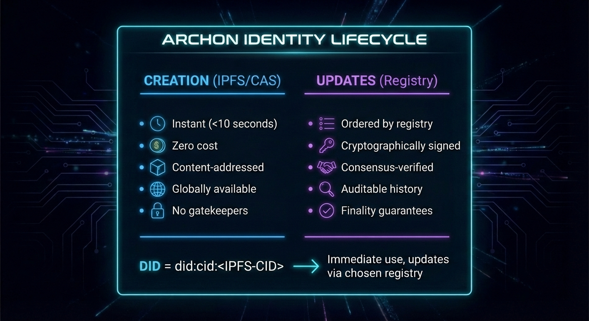

### 3.2 Multi-Registry Architecture

Rather than mandating a single consensus mechanism, Archon supports multiple registries, each with different characteristics:

| Registry | Confirmation Time | Cost | Finality | Best For |
|----------|-------------------|------|----------|----------|
| Hyperswarm | Seconds | Free | Eventual; competing updates resolved deterministically | Development, internal systems |
| Bitcoin-family (`BTC:mainnet`, `BTC:testnet4`, `BTC:signet`) | First confirmation, ~10 minutes on average | Miner fee per batch; testnet/signet use test coins | Strong proof-of-work finality; the mediator rewinds and re-imports after a reorg | Enterprise, legal identity, testing |
| Zcash (`ZEC:mainnet`, `ZEC:testnet`) | First confirmation in ~75 seconds | ZIP-317 conventional fee per batch; testnet uses test coins | Strong proof-of-work finality | Transparent Zcash anchoring |
| Ethereum (`ETH:mainnet`, `ETH:sepolia`) | After finalization, ~13 minutes | Gas for one `ArchonRegistry` transaction per batch | Proof-of-stake finality; anchors are imported only once finalized | EVM anchoring and contract discovery |
| Solana (`SOL:mainnet-beta`, `SOL:devnet`) | After finalization, ~13 seconds | Lamports for one Memo transaction per batch | Proof-of-stake finality; anchors are imported only once finalized | High-throughput anchoring |

Users select their registry at DID creation based on their specific requirements, enabling a spectrum of security-cost trade-offs. A DID can later migrate to another registry with a signed update. Nodes also support the unanchored `local` and `pin` registries; the [Gatekeeper specification](services/gatekeeper/README.md) describes their semantics.

### 3.3 W3C Compliance

Archon implements the full W3C DID specification, ensuring interoperability with the broader decentralized identity ecosystem:

- Standard DID document structure
- Verification methods and authentication
- Service endpoints
- DID resolution with metadata

---

## 4. Technical Architecture

### 4.1 System Overview

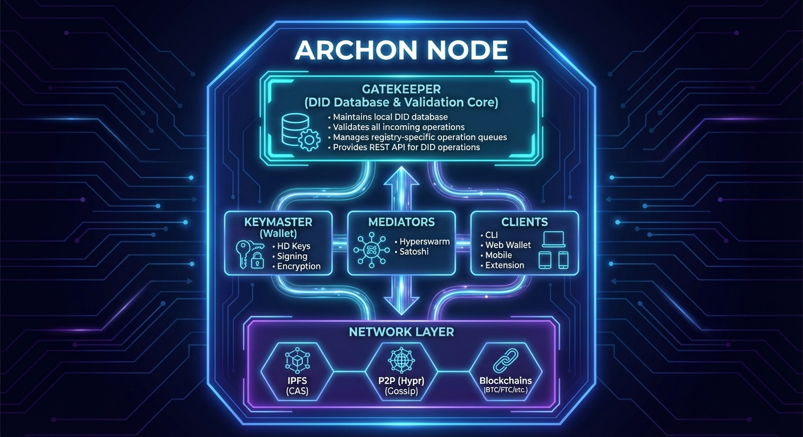

### 4.2 Core Components

#### Gatekeeper

The Gatekeeper serves as the authoritative local source for DID state. It:

- Receives and validates DID operations
- Maintains operation queues per registry
- Merges operations from multiple sources
- Provides a REST API for DID CRUD operations
- Supports multiple database backends (Redis, MongoDB, SQLite, JSON)

Two interchangeable implementations exist, one in TypeScript and one in native Rust. They serve the same HTTP API, and a cross-implementation parity suite checks that they accept, reject and resolve operations identically.

#### Keymaster

The Keymaster is the wallet responsible for:

- BIP-32 hierarchical deterministic key derivation
- BIP-39 mnemonic seed phrase management
- secp256k1 ECDSA signing of DID operations and credentials, with optional Ed25519 credential proofs (§9.1)
- Encryption/decryption of messages and credentials
- Wallet backup and recovery

It runs as a library inside a client, or as a REST service used by the `archon` CLI, the demo clients and an MCP server for AI agents. TypeScript and Python implementations are kept in parity and read the same wallet format.

#### Drawbridge

Drawbridge is the node's public API gateway:

- Fronts Gatekeeper and the node's optional services (Herald, the Lightning mediator, the DIDComm relay and the explorer)
- Supports L402 (formerly LSAT) authentication for API monetization, while keeping DID resolution and IPFS reads free
- Serves the Lightning endpoints that DID documents advertise in their `#lightning` service entries, delegating invoices and payments to the Lightning mediator
- Optionally fronted by a Tor hidden service for privacy-preserving access

#### Herald

Herald is the node's name service. A user proves control of a DID through challenge-response, claims a short `@name` handle, and receives a verifiable credential attesting to it. Herald publishes its directory as JSON, IPNS, LUD-16 Lightning addresses, WebFinger and OpenID Connect.

#### DIDComm Relay

An optional store-and-forward mailbox for DIDComm Messaging v2. Senders post encrypted envelopes; a recipient proves control of its DID and fetches its queued envelopes to decrypt locally. The relay holds no private keys and cannot read what it stores.

#### Mediators

Mediators synchronize DID operations across network boundaries:

- **Hyperswarm Mediator**: Distributes operations via P2P gossip protocol
- **Satoshi Mediator**: Anchors operation batches to Bitcoin-family registries via OP_RETURN
- **Zcash Mediator**: Anchors operation batches to transparent Zcash transactions
- **Ethereum Mediator**: Anchors operation batches through canonical `ArchonRegistry` contracts
- **Solana Mediator**: Anchors operation batches through Memo-program payloads
- **Pinning Mediator**: Keeps operations available through an IPFS Pinning Service for the registries an operator opts in
- **Filecoin Mediator**: Stores operations with Filecoin storage proofs where a deployment needs them
- **Lightning Mediator**: Creates invoices and makes payments, including zaps, for Drawbridge

### 4.3 Data Flow

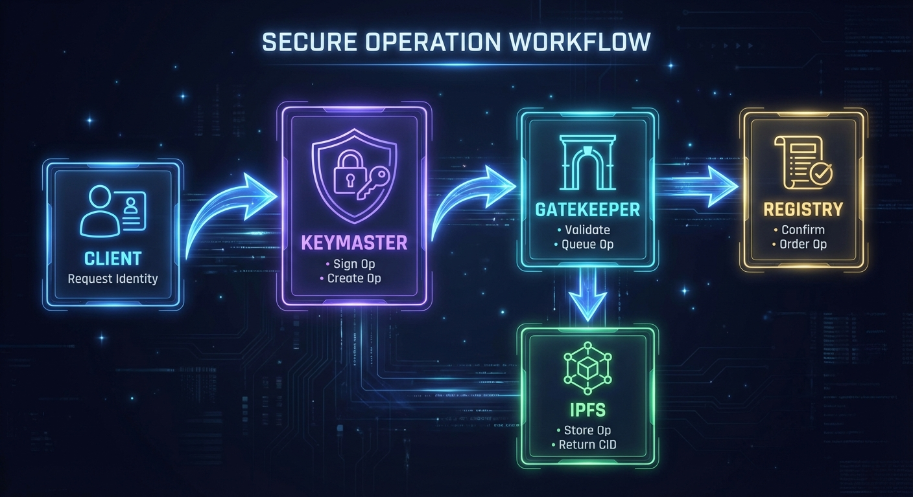

---

## 5. The did:cid Method

### 5.1 Method Specification

The `did:cid` method leverages Content Identifiers (CIDs) from IPFS to create self-certifying, content-addressed DIDs:

```
did:cid:<cid>[;service][/path][?query][#fragment]
```

Where:
- `cid`: A CIDv1 encoded in base32 (multibase prefix 'b')
- Optional components follow standard DID URL syntax

Example:
```
did:cid:bafkreig6rjxbv2aopv47dgxhnxepqpb4yrxf2nvzrhmhdqthojfdxuxjbe
```

### 5.2 DID Types

Archon supports two fundamental DID types:

**Agent DIDs**
- Possess cryptographic keys
- Can sign operations
- Controlled by a private key holder
- Used for: users, organizations, services, IoT devices

**Asset DIDs**
- No cryptographic keys
- Controlled by an owning Agent DID
- Used for: credentials, schemas, documents, data

### 5.3 DID Document Structure

```json
{
  "didDocument": {
    "@context": ["https://www.w3.org/ns/did/v1"],
    "id": "did:cid:bafkreig6rjxbv2aopv47dgxhnxepqpb4yrxf2nvzrhmhdqthojfdxuxjbe",
    "verificationMethod": [{
      "id": "#key-1",
      "controller": "did:cid:bafkreig6rjxbv...",
      "type": "EcdsaSecp256k1VerificationKey2019",
      "publicKeyJwk": {
        "kty": "EC",
        "crv": "secp256k1",
        "x": "...",
        "y": "..."
      }
    }],
    "authentication": ["#key-1"],
    "assertionMethod": ["#key-1"],
    "capabilityInvocation": ["#key-1"]
  },
  "didDocumentMetadata": {
    "created": "2024-01-15T10:30:00Z",
    "versionId": "bafkrei...",
    "versionSequence": "1",
    "confirmed": true
  },
  "didDocumentData": {},
  "didDocumentRegistration": {
    "registry": "hyperswarm",
    "type": "agent",
    "version": 1
  }
}
```

Metadata members appear only when they apply: `updated` after the first update, `deleted` and `deactivated: true` after a delete, and `timestamp` when the document's registry supplies one (§7.4). `confirmed` means every event in the resolved history arrived on the DID's own registry. The [Gatekeeper specification](services/gatekeeper/README.md) defines the full resolution algorithm, and the standards-conformant `/1.0/identifiers` endpoint returns the W3C resolution subset.

### 5.4 Operations

All DID state changes occur through signed operations:

**Create Operation**
```json
{
  "type": "create",
  "created": "2024-01-15T10:30:00Z",
  "registration": {
    "registry": "hyperswarm",
    "type": "agent",
    "version": 1
  },
  "publicJwk": {
    "kty": "EC",
    "crv": "secp256k1",
    "x": "...",
    "y": "..."
  },
  "proof": {
    "type": "DataIntegrityProof",
    "cryptosuite": "archon-ecdsa-secp256k1-jcs-2026",
    "created": "2024-01-15T10:30:00Z",
    "verificationMethod": "#key-1",
    "proofPurpose": "capabilityInvocation",
    "proofValue": "..."
  }
}
```

**Update Operation**
```json
{
  "type": "update",
  "did": "did:cid:bafkrei...",
  "doc": {
    "didDocumentData": {
      "profile": {
        "name": "Alice"
      }
    }
  },
  "previd": "bafkrei...",
  "proof": {
    "type": "DataIntegrityProof",
    "cryptosuite": "archon-ecdsa-secp256k1-jcs-2026",
    "created": "2024-01-16T14:00:00Z",
    "verificationMethod": "did:cid:bafkrei...#key-1",
    "proofPurpose": "capabilityInvocation",
    "proofValue": "..."
  }
}
```

**Delete Operation**
```json
{
  "type": "delete",
  "did": "did:cid:bafkrei...",
  "previd": "bafkrei...",
  "proof": {
    "type": "DataIntegrityProof",
    "cryptosuite": "archon-ecdsa-secp256k1-jcs-2026",
    "created": "2024-01-17T09:00:00Z",
    "verificationMethod": "did:cid:bafkrei...#key-1",
    "proofPurpose": "capabilityInvocation",
    "proofValue": "..."
  }
}
```

Operations on a blockchain registry may also carry a `blockid` naming a recent block, which gives the operation a lower timestamp bound (§7.4). Operations anchored before the `archon-ecdsa-secp256k1-jcs-2026` suite existed carry the legacy `EcdsaSecp256k1Signature2019` proof with `proofPurpose: "authentication"`; both Gatekeeper implementations accept those indefinitely, because every node replays its own history. The [DID scheme](scheme.md) specifies both suites and includes a checked, signed example.

---

## 6. The didDocumentData Extension

### 6.1 Beyond the W3C Standard

One of Archon's principal extensions is the `didDocumentData` field—an extension to the standard DID document structure that enables arbitrary application data to be stored alongside the identity itself. While the W3C DID Core specification defines the structure of `didDocument` and `didDocumentMetadata`, it also explicitly supports extensibility through additional properties.

The W3C DID specification states that DID methods may add custom properties beyond the core specification, provided they support lossless conversion between representations. Archon leverages this extensibility to introduce `didDocumentData`: a flexible, schema-free container for application-specific data that travels with the DID throughout its lifecycle.

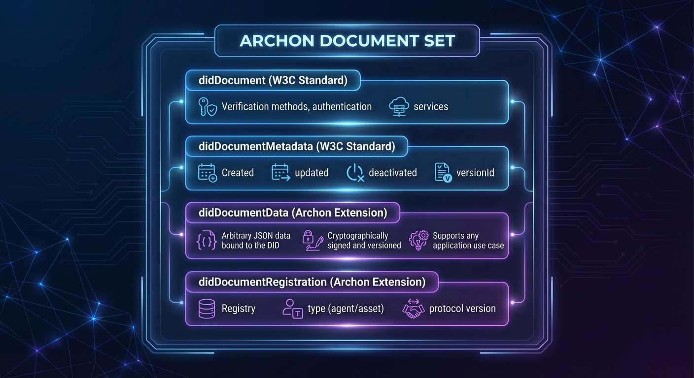

### 6.2 Design Philosophy

Traditional DID systems treat identities as static containers for cryptographic keys and service endpoints. Archon recognizes that real-world identities are dynamic, accumulating attributes, relationships, and context over time. The `didDocumentData` field transforms DIDs from mere identifiers into rich, self-sovereign data containers.

**Key Properties:**

1. **Schema-Free**: No predefined structure—applications define their own data schemas
2. **Cryptographically Bound**: All data is signed by the DID controller, ensuring authenticity
3. **Version-Controlled**: Every change creates a new version with full audit trail
4. **Replicated**: Data is content-addressed and, depending on the registry chosen, synchronized across nodes (§3.2); a content address guarantees integrity, while availability depends on nodes continuing to hold the operation (§10.3)
5. **Controller-Owned**: Only the DID controller can modify the data

### 6.3 Use Cases Enabled by didDocumentData

The `didDocumentData` extension unlocks an expansive range of applications that would be impossible or impractical with standard DID documents:

#### Credential Manifests

Users can publish verified credentials to their DID, creating a public or selectively-disclosed portfolio:

```json
{
  "didDocumentData": {
    "manifest": {
      "did:cid:bafkrei...degree": {
        "type": ["VerifiableCredential", "UniversityDegree"],
        "issuer": "did:cid:bafkrei...stanford",
        "credentialSubject": {
          "degree": "Bachelor of Science in Computer Science"
        }
      },
      "did:cid:bafkrei...certification": {
        "type": ["VerifiableCredential", "ProfessionalCertification"],
        "issuer": "did:cid:bafkrei...aws",
        "credentialSubject": {
          "certification": "AWS Solutions Architect"
        }
      }
    }
  }
}
```

This enables LinkedIn-style professional profiles that are fully decentralized and cryptographically verifiable. The holder chooses what to disclose: a credential published without being revealed shows only its subject, and its claims appear in the manifest only when the holder reveals it.

#### Wallet Backup

The wallet's seed bank is a DID derived from the recovery phrase itself (§10.1). A backup is an asset DID holding the encrypted wallet, and the seed bank points to it:

```json
{
  "didDocumentData": {
    "wallet": "did:cid:bafkrei...backup"
  }
}
```

The backup asset's own data is `{ "backup": "<ciphertext>" }`. Because the seed bank's DID can be regenerated from the phrase, users can recover every backed-up identity, with its credentials and relationships, from the seed phrase alone.

#### Digital Assets as DIDs

Images, documents, and structured data become first-class citizens with their own DIDs:

```json
{
  "didDocumentData": {
    "file": {
      "cid": "bafkrei...",
      "filename": "profile.png",
      "type": "image/png",
      "bytes": 48213
    },
    "image": {
      "width": 512,
      "height": 512
    }
  }
}
```

The bytes themselves live in IPFS under their CID; the asset DID records the reference and metadata, so updating the image is an ordinary signed update.

#### Encrypted Communications

End-to-end encrypted messages stored with DIDs:

```json
{
  "didDocumentData": {
    "encrypted": {
      "cipher_hash": "a1b2c3...",
      "cipher_sender": "encrypted-for-sender...",
      "cipher_receiver": "encrypted-for-receiver..."
    }
  }
}
```

The sender is the asset's controller and the creation time is in its metadata, so neither is repeated here. `cipher_hash` is present only when the sender asks for it, as challenge responses do (§8.5).

#### Organizational Structures

Groups with public membership lists, which can nest other groups:

```json
{
  "didDocumentData": {
    "name": "Engineering Team",
    "group": {
      "version": 2,
      "members": [
        "did:cid:bafkrei...alice",
        "did:cid:bafkrei...bob",
        "did:cid:bafkrei...carol"
      ]
    }
  }
}
```

#### Notices and Announcements

Short-lived pointers that tell recipients a DID is waiting for them, such as a D-Mail or a poll ballot:

```json
{
  "didDocumentData": {
    "notice": {
      "to": ["did:cid:bafkrei...recipient"],
      "dids": ["did:cid:bafkrei...dmail"]
    }
  }
}
```

A notice carries no content of its own. It expires through the asset's `validUntil`, after which nodes may garbage-collect it.

#### Polls and Governance

Polls among the members of a vault (§8.3). The poll definition is an encrypted vault item, readable only by members:

```json
{
  "version": 2,
  "name": "budget-q4",
  "description": "Approve budget proposal?",
  "options": ["Yes", "No", "Abstain"],
  "deadline": "2024-02-01T00:00:00Z"
}
```

### 6.4 W3C Compatibility

The W3C DID Core specification explicitly supports extensibility. Section 4.1 states:

> "For maximum interoperability, it is RECOMMENDED that extensions use the W3C DID Specification Registries mechanism... It is always possible for two specific implementations to agree out-of-band to use a mutually understood extension."

Archon's `didDocumentData` follows this guidance:

1. **Additive Extension**: The field is added alongside standard properties, not replacing them
2. **Lossless Conversion**: Standard DID resolution tools receive valid W3C-compliant documents
3. **Namespace Separation**: Application data is isolated from core identity properties
4. **Graceful Degradation**: Systems unaware of `didDocumentData` can still resolve and verify DIDs

### 6.5 Security Considerations

All data in `didDocumentData` inherits the security properties of the DID system:

- **Authentication**: Only the DID controller (holder of the private key) can modify the data
- **Integrity**: Every change is cryptographically signed and content-addressed
- **Non-Repudiation**: The signature proves the controller authorized the data
- **Auditability**: Full version history is preserved through the operation chain
- **Revocation**: Revoking a DID appends a `delete` operation, after which resolution returns an empty `didDocumentData` and marks the document deactivated

**Revocation is not erasure.** The operation chain is append-only, so a revocation adds a version rather than removing earlier ones. Everything published in an earlier version remains in the operation history, in whatever IPFS pins and caches hold those operations, and in any copies third parties have already retrieved. Time-travel resolution (§8.1) to a version before the revocation still returns the earlier `didDocumentData` in full — the same property that makes the audit trail trustworthy makes revocation a change of current state, not a deletion.

Controllers should therefore treat anything written to `didDocumentData` as permanently published. Data that may later need to be withdrawn belongs behind a reference rather than in the field itself: an encrypted payload whose key can be destroyed, or a pointer to storage the controller operates.

### 6.6 Comparison with Alternatives

| Approach | Storage | Verifiability | Cost | Flexibility |
|----------|---------|---------------|------|-------------|
| **didDocumentData** | Content-addressed; replication depends on the registry (§3.2) | Signed by the controller | No registry fee on Hyperswarm; per-batch fee on blockchain registries | Schema-free |
| Off-chain with hash | External systems | Hash-only | Variable | Full |
| Service endpoints | External URLs | None | Variable | Full |
| On-chain storage | Blockchain | Full | High | Limited |

The comparisons above are qualitative summaries rather than measurements. The `didDocumentData` approach trades the availability guarantees of a hosted system for controller-signed verifiability and, on Hyperswarm, no per-operation registry fee.

---

## 7. Registry System

### 7.1 Registry Abstraction

Archon's registry system provides a unified interface across different consensus mechanisms:

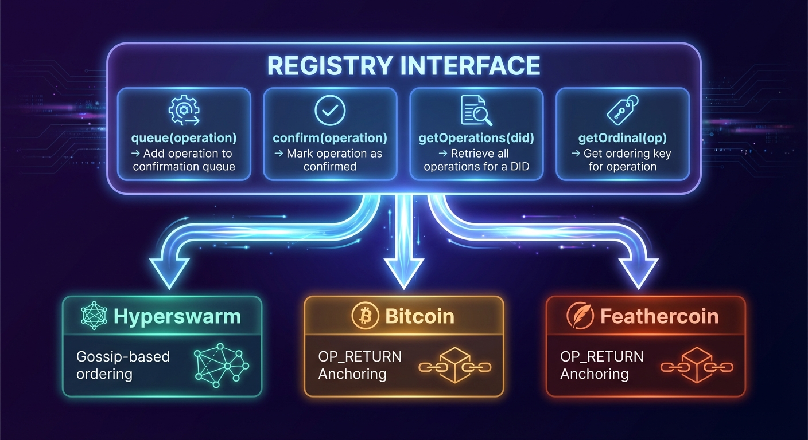

### 7.2 Hyperswarm Registry

The Hyperswarm registry provides fast, peer-to-peer operation distribution:

**Characteristics:**
- Confirmation time: Seconds
- Cost: Zero
- Finality: Eventual consistency (gossip-based)
- Ordering: The `previd` chain, with a deterministic choice between competing updates

**Mechanism:**
1. Mediators join a shared Hyperswarm topic and exchange operation batches with their peers
2. Peers validate and store operations locally
3. When two valid updates name the same predecessor, every node keeps the one with the lexicographically smallest canonical CID; clocks and arrival order play no part
4. Nodes holding the same operations converge on the same history

**Best for:** Development, testing, internal organizational use, applications where speed matters more than finality

### 7.3 Blockchain Registries

Blockchain registries order updates through each chain's consensus. Every chain mediator follows the same pattern:

1. Operations for the registry accumulate in a Gatekeeper queue
2. The mediator stores each operation in IPFS and creates a batch asset DID, `{ "batch": { "version": 1, "ops": [<CID>, ...] } }`
3. One transaction per batch records the batch DID on chain
4. Every node running the mediator scans the chain, fetches the batch, and imports its operations with their chain position

Mediators skip batches whose content is not yet available and retry them later, keeping the original chain position.

**Bitcoin-family (Satoshi mediator)**
- Anchor: the batch DID as UTF-8 in a standard `OP_RETURN` output
- Import: after the first confirmation; on a reorg the mediator rewinds (6 blocks by default), withdraws orphaned receipts and rescans
- Cost: miner fee per batch

**Zcash**
- Anchor: the batch DID in a transparent `OP_RETURN` transaction, verified against a Zebra node
- Import: after the first confirmation, with the same reorg handling as Bitcoin
- Cost: the ZIP-317 conventional fee per batch

**Ethereum**
- Anchor: an `ArchonBatch` event from the registry's one canonical `ArchonRegistry` contract
- Import: only once the block is finalized; a rollback of finalized history is outside automatic recovery
- Cost: gas for one transaction per batch

**Solana**
- Anchor: a Memo-program instruction with an `ARCHON_BATCH_V1:` payload, signed by a deterministic registry signer so nodes can discover anchors by address
- Import: only once finalized
- Cost: lamports for one transaction per batch

### 7.4 Blockchain Timestamping

Archon provides automatic cryptographic timestamping for DID operations registered on block-producing registries. When a DID operation is anchored to Bitcoin, Zcash, Ethereum, Solana, or another blockchain registry, it inherits an immutable, independently verifiable timestamp from the block in which it was confirmed.

#### How Timestamping Works

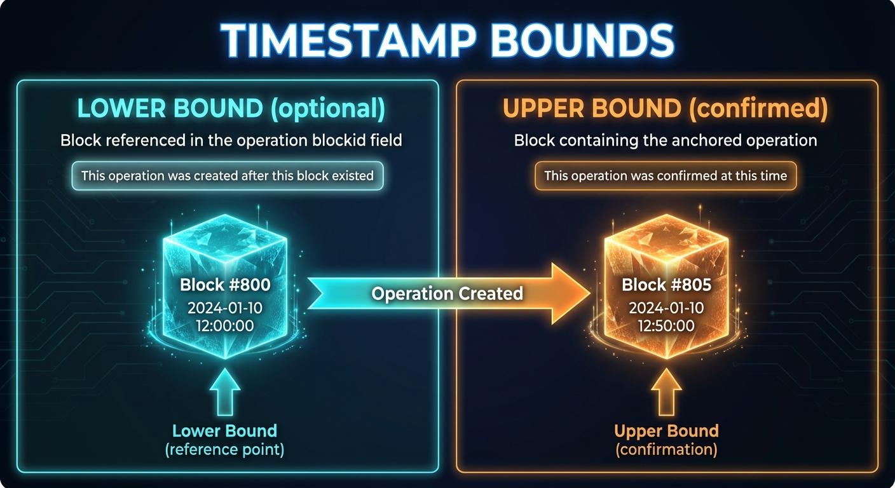

When resolving a DID, the `didDocumentMetadata` includes timestamp information:

```json
{
  "didDocumentMetadata": {
    "created": "2024-01-15T10:30:00Z",
    "updated": "2024-01-16T14:00:00Z",
    "versionId": "bafkrei...",
    "versionSequence": "2",
    "confirmed": true,
    "timestamp": {
      "chain": "BTC:signet",
      "opid": "bafkrei...",
      "lowerBound": {
        "time": 1705312800,
        "timeISO": "2024-01-15T10:00:00Z",
        "blockid": "00000000000000000002a7c4...",
        "height": 826000
      },
      "upperBound": {
        "time": 1705316400,
        "timeISO": "2024-01-15T11:00:00Z",
        "blockid": "00000000000000000001b8f2...",
        "height": 826005,
        "txid": "a1b2c3d4e5f6...",
        "txidx": 42,
        "batchid": "bafkrei...",
        "opidx": 3
      }
    }
  }
}
```

#### Timestamp Components

**Lower Bound** (optional): Created when the operation includes a `blockid` field referencing a recent block at the time of creation. This proves the operation was created *after* that block existed, establishing a "not before" time.

**Upper Bound** (present when the anchoring block is known): The block in which the operation batch was anchored. Unanchored registries such as Hyperswarm supply no bounds. This provides:
- `time`: Unix timestamp of the block
- `timeISO`: Human-readable ISO 8601 format
- `blockid`: The block hash (independently verifiable)
- `height`: Block height in the chain
- `txid`: Transaction ID containing the batch
- `txidx`: Transaction index within the block
- `batchid`: CID of the operation batch
- `opidx`: Index of this operation within the batch

#### Why Blockchain Timestamps Matter

**1. Legal Admissibility**

Blockchain timestamps provide cryptographic proof of existence at a specific time. Unlike self-asserted timestamps, blockchain timestamps are:
- Independently verifiable by any node
- Immutable once confirmed
- Backed by the registry's consensus mechanism
- Anchored to a globally-recognized timechain

This makes them suitable for legal contexts where proving "when" something happened matters:
- Contract signing dates
- Intellectual property registration
- Regulatory compliance timestamps
- Audit trails

**2. Temporal Ordering**

Within one chain, the ordinal key `{block height, transaction index, operation index}`, plus any chain-specific position, orders every anchored operation, resolving any ambiguity about which came first. Ordinals are never compared across chains, and in the rare case of equal ordinals the canonical CID decides. This is critical for:
- Key rotation (ensuring old keys can't sign "backdated" operations)
- Credential revocation (proving when a credential was revoked)
- Dispute resolution (establishing timeline of events)

**3. Trust Minimization**

Traditional timestamping services require trusting a third party. Blockchain timestamps derive their trustworthiness from:
- Decentralized consensus (no single authority)
- Economic security (cost of attack exceeds benefit)
- Transparent verification (anyone can audit)

**4. Proof of Non-Existence**

The timestamp system also enables proving that something *didn't* exist before a certain time. If an operation's lower bound is block N, it cannot have existed before block N was mined.

#### Timestamp Precision by Registry

| Registry | Typical Precision | Verification |
|----------|-------------------|--------------|
| Bitcoin-family | ~10 minutes (block time) | Full-node RPC |
| Zcash | ~75 seconds | Zebra-backed block and transaction checks |
| Ethereum | ~12 seconds | RPC log and block verification |
| Solana | Seconds | RPC signature and block-height verification |
| Hyperswarm | Self-asserted (`proof.created`) | None beyond the signature |

#### Use Cases for Timestamps

**Intellectual Property**: Prove when a creative work was first registered, establishing priority for copyright or patent claims.

**Credential Validity Windows**: Verify that a credential was issued before its expiration date and hadn't been revoked at the time of use.

**Audit Compliance**: Demonstrate that required attestations or certifications were in place at specific regulatory checkpoints.

**Legal Evidence**: Provide court-admissible proof of when digital agreements, signatures, or declarations were made.

**Version Control**: Establish authoritative ordering of document revisions or identity updates, preventing "time-warp" attacks.

---

## 8. Advanced Features

Beyond the core DID functionality, Archon includes several advanced features that extend the protocol into a comprehensive identity and communication platform.

### 8.1 Time-Travel Resolution

Archon supports resolving DIDs at any point in their history, enabling powerful audit and compliance capabilities.

**Resolution Options:**

```javascript
// Resolve at a specific point in time
resolveDID(did, { versionTime: "2024-01-15T10:00:00Z" })

// Resolve a specific version number
resolveDID(did, { versionSequence: 3 })

// Stop at the first update not yet confirmed on the DID's registry
resolveDID(did, { confirm: true })

// Verify operation proofs while resolving
resolveDID(did, { verify: true })
```

**How It Works:**

Every update and delete operation includes a `previd` field linking to the previous operation, creating an immutable chain back to the create operation:

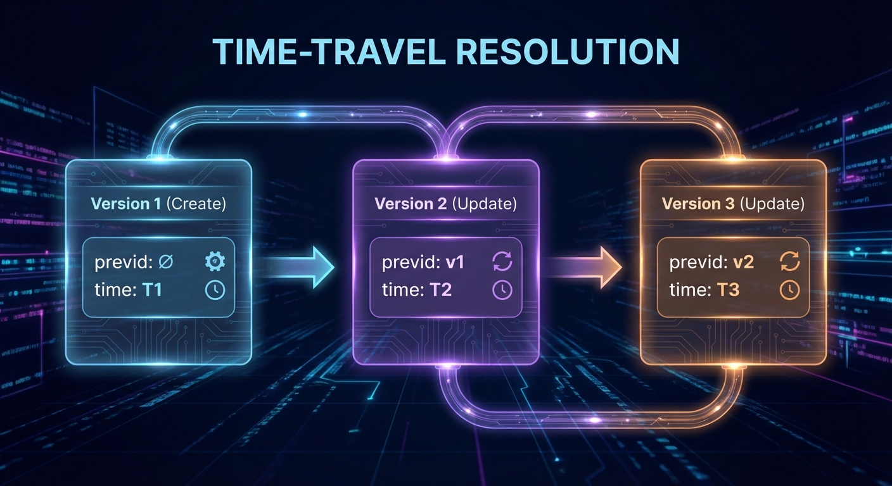

The resolver walks this chain, applying operations up to the requested time/version, then returns the reconstructed document state.

**Use Cases:**
- **Audit trails**: Prove what credentials existed at a specific regulatory checkpoint
- **Dispute resolution**: Establish the state of an identity at a contested point in time
- **Recovery**: Examine historical states to understand how a DID evolved
- **Compliance**: Demonstrate historical compliance at any point

### 8.2 Decentralized Messaging (D-Mail)

Archon includes a complete decentralized email system built on top of the DID infrastructure:

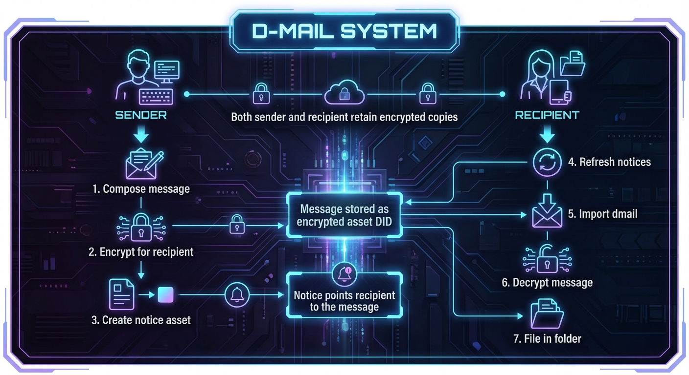

Each message is a vault (§8.4) owned by the sender, with every `to` and `cc` recipient added as a member, so the sender and all recipients can decrypt it and no one else can.

**Features:**
- **Folder organization**: wallet tags `inbox`, `sent`, `draft`, `archived` and `deleted`
- **CC support**: Every recipient is a vault member
- **Attachments**: Files stored as further items in the same vault
- **Read tracking**: `unread` tag for new messages
- **Delivery**: Sending creates a notice (§6.3) addressed to the recipients, valid for 7 days, which their wallets pick up and file in their inboxes
- **Threading**: An optional `reference` names the message being replied to

**Message Structure** (the encrypted `dmail` vault item):
```json
{
  "dmail": {
    "to": ["did:cid:bafkrei...bob"],
    "cc": ["did:cid:bafkrei...carol"],
    "subject": "Meeting Tomorrow",
    "body": "See you at ten.",
    "reference": "did:cid:bafkrei...earlier-message"
  }
}
```

The sender is the vault's controller, and the send time comes from its metadata.

### 8.3 Polls

A poll is a vault (§8.4) whose members are its eligible voters. The poll definition (§6.3) is an encrypted vault item with a description, two to ten options and a deadline.

**Voting:**

1. A member casts a ballot: an asset DID holding `{ poll, vote }`, encrypted to the poll owner and to the voter
2. The voter sends the ballot to the owner with a notice (§6.3)
3. The owner adds the ballot to the poll vault, keyed by a salted hash of the voter's DID
4. After the deadline, or once every member has voted, the owner can publish the results as a vault item that members can read

**Privacy properties:**

- **Ballots are private from other voters.** Only the poll owner and the voter can decrypt a ballot. The owner can see how each member voted.
- **Published results can omit individual ballots.** `publishPoll` publishes the tally alone by default, or every ballot with `reveal`.
- **Spoiled ballots.** A vote of `0` spoils the ballot. It counts as participation and is tallied separately as `spoil`, so members can take part without choosing an option. It does not hide that the member voted.

### 8.4 Vaults

Vaults are shared encrypted storage. The owner creates a vault, adds members, and adds items (files, messages, poll ballots); every member can decrypt the items.

**How vaults work:**

1. **Shared vault key**: Each vault has one key pair. Items are encrypted to its public key, and its private key is encrypted separately to each member.
2. **Salted member index**: Each member's copy of the key is stored under a hash of the vault's salt and the member's DID, so the index does not show DIDs in the clear.
3. **Owner-managed contents**: Only the owner adds or removes members and items.

**Secret membership.** With the `secretMembers` option, the member list is encrypted to the owner alone, so members cannot list who else belongs. This keeps the roster from casual disclosure but is not anonymity: the salt is public, so anyone who can guess a DID can test whether it is a member.

**Use cases:**
- **Shared team storage**: Files and documents readable by a defined set of DIDs
- **Private correspondence**: D-Mail messages (§8.2) are vaults
- **Committee polls**: Polls (§8.3) whose electorate is the vault's membership

### 8.5 Challenge-Response Authentication

Archon provides a flexible challenge-response system for authentication and authorization:

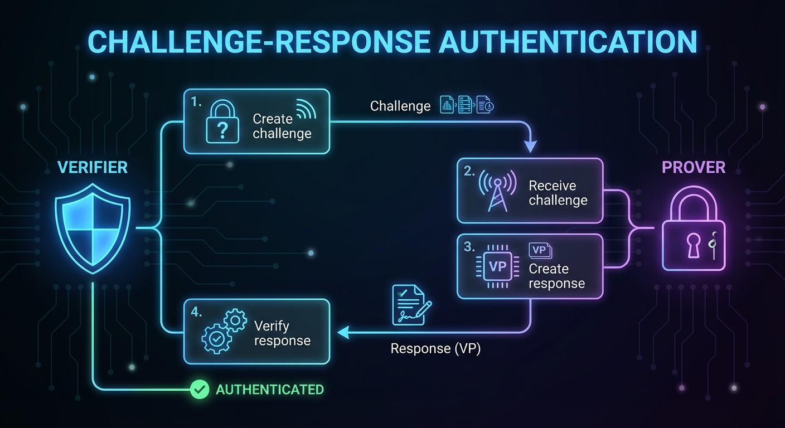

A challenge is a short-lived asset DID (valid for one hour by default) created by the verifier. Its DID is unique, so it serves as the nonce.

**Challenge Types:**

1. **Simple Identity Challenge**: An empty challenge; answering it proves control of the responding DID
2. **Credential Challenge**: Prove you hold a credential for a given schema
3. **Issuer-Specific Challenge**: The same, restricted to a list of issuers

**Challenge Structure** (the challenge asset's data):
```json
{
  "challenge": {
    "credentials": [
      {
        "schema": "did:cid:bafkrei...employee-schema",
        "issuers": ["did:cid:bafkrei...acme-corp"]
      }
    ]
  }
}
```

**Response Structure** (an asset encrypted to the verifier and signed by the holder):
```json
{
  "response": {
    "challenge": "did:cid:bafkrei...challenge",
    "credentials": [
      {
        "vc": "did:cid:bafkrei...credential",
        "vp": "did:cid:bafkrei...presentation"
      }
    ],
    "requested": 1,
    "fulfilled": 1,
    "match": true
  }
}
```

Each `vp` is the holder's copy of a credential re-encrypted to the verifier. The verifier checks that it hashes to the same content as the issued credential `vc`, that the credential's proof verifies against its issuer, and that the credential DID has not been revoked.

### 8.6 Lightning Payments

Archon integrates with the Bitcoin Lightning Network to enable instant, low-cost payments between DIDs. By binding Lightning capabilities directly to decentralized identities, Archon creates a payment layer where any DID holder can send and receive satoshis without revealing personal information.

#### Publishing Lightning Capability

An agent publishes its Lightning receiving capability by registering an invoice key with a Drawbridge gateway and adding a `#lightning` service entry to its DID document:

```json
{
  "didDocument": {
    "service": [
      {
        "id": "did:cid:bafkrei...alice#lightning",
        "type": "Lightning",
        "serviceEndpoint": "https://drawbridge.example.com/invoice/bafkrei...alice"
      }
    ]
  }
}
```

Any party resolving the DID can discover the Lightning endpoint and initiate a payment without prior coordination. The endpoint host is the Drawbridge's public address, which may be a Tor `.onion` address.

#### Zap Protocol

The [Archon "zap" protocol](lightning-zap-sequence.md) enables sending satoshis to any DID, alias, or LUD-16 Lightning Address:

```
zap <recipient> <amount_sats> [memo]
```

**DID/Alias Flow:**
1. Keymaster resolves the recipient alias or DID, loads the sender's LNbits admin key from the wallet, and sends the zap to Drawbridge (`POST /lightning/zap`), which forwards it to the Lightning mediator
2. The Lightning mediator resolves the recipient DID via Gatekeeper to locate the `#lightning` service endpoint
3. It requests a BOLT11 invoice from the recipient's Lightning service (`.onion` endpoints are reached via Tor; clearnet endpoints require HTTPS with SSRF protection)
4. It pays the invoice through the sender's LNbits instance, which routes the payment across the Lightning Network

**LUD-16 Address Flow (user@domain):**
1. Keymaster detects the `@` in the recipient string and sends the zap through Drawbridge to the Lightning mediator
2. The Lightning mediator fetches `https://domain/.well-known/lnurlp/user` for the LNURL-pay metadata (SSRF-protected)
3. It requests a BOLT11 invoice from the callback URL with the amount in millisatoshis
4. It pays the invoice through the sender's LNbits instance

Both flows return a `paymentHash` to the caller for tracking. This unified interface abstracts away the differences between DID-native Lightning endpoints and standard LNURL/Lightning Address recipients.

#### Payment Tracking

The wallet lists incoming and outgoing Lightning payments with their status:

```json
{
  "paymentHash": "a1b2c3...",
  "amount": -1000,
  "fee": 2,
  "memo": "Thanks for the article",
  "time": "2024-01-15T10:30:00Z",
  "pending": false,
  "status": "success"
}
```

`amount` is positive for incoming payments and negative for outgoing ones. `status` is `pending`, `success` or `failed`, and invoices also carry an `expiry`.

### 8.7 L402 API Gateway

Drawbridge implements the L402 protocol (formerly LSAT) to enable machine-readable, pay-per-use access to API endpoints. L402 combines HTTP 402 (Payment Required) status codes with Lightning invoices and macaroon-based authentication tokens.

#### How L402 Works

1. Client requests a protected resource (any Drawbridge route other than the free ones: DID resolution, IPFS reads, and status endpoints)
2. Drawbridge returns HTTP 402 with a macaroon (containing caveats for scope, expiry, and payment hash) and a BOLT11 Lightning invoice
3. Client pays the invoice through the Lightning Network, receiving a preimage as proof of payment
4. Client re-requests the resource with `Authorization: L402 <macaroon>:<preimage>`
5. Drawbridge verifies the preimage cryptographically (`SHA256(preimage) == paymentHash`) and validates the macaroon's HMAC chain and caveats, then grants access

#### API Monetization

L402 enables fine-grained monetization of identity services:

- **Per-request pricing**: Each API call requires a micro-payment
- **Hybrid auth**: Internal services present the node's admin key and skip payment, while outside callers pay
- **No accounts required**: Anonymous, permissionless access via payment alone

This allows Archon node operators to charge for DID registration and updates, relays, and other services without requiring user registration or payment processors, while anyone can still resolve DIDs for free.

### 8.8 Key Rotation

Archon supports secure key rotation without changing the DID:

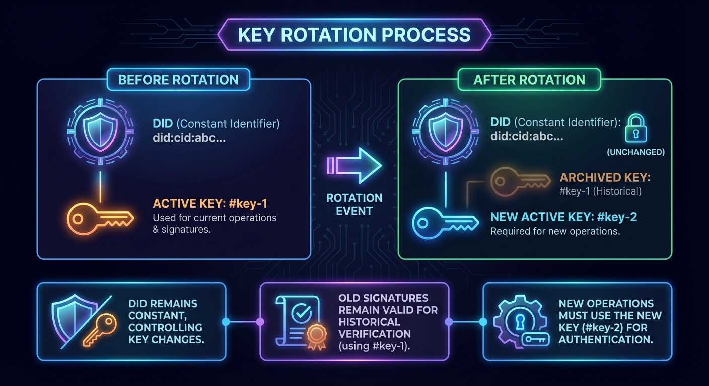

**Security Properties:**
- Old keys cannot sign new operations (each operation is verified against the document its `previd` names)
- Historical signatures remain verifiable
- Compromised keys can be rotated without losing identity
- Key rotation is itself timestamped on blockchain registries

---

## 9. Verifiable Credentials

### 9.1 W3C Verifiable Credentials Support

Archon issues credentials in the W3C Verifiable Credentials Data Model 2.0, secured with Data Integrity proofs:

```json
{
  "@context": [
    "https://www.w3.org/ns/credentials/v2",
    "https://www.w3.org/ns/credentials/examples/v2"
  ],
  "type": ["VerifiableCredential", "UniversityDegreeCredential"],
  "issuer": "did:cid:bafkrei...",
  "validFrom": "2024-01-15T00:00:00Z",
  "credentialSchema": {
    "id": "did:cid:bafkrei...degree-schema",
    "type": "JsonSchema"
  },
  "credentialSubject": {
    "id": "did:cid:bafkrei...",
    "degree": {
      "type": "BachelorDegree",
      "name": "Bachelor of Science"
    }
  },
  "proof": [
    {
      "type": "DataIntegrityProof",
      "cryptosuite": "archon-ecdsa-secp256k1-jcs-2026",
      "created": "2024-01-15T00:00:00Z",
      "verificationMethod": "did:cid:bafkrei...#key-1",
      "proofPurpose": "assertionMethod",
      "proofValue": "..."
    },
    {
      "type": "DataIntegrityProof",
      "cryptosuite": "eddsa-jcs-2022",
      "created": "2024-01-15T00:00:00Z",
      "verificationMethod": "did:cid:bafkrei...#key-assertion-1",
      "proofPurpose": "assertionMethod",
      "proofValue": "z..."
    }
  ]
}
```

Every credential carries the `archon-ecdsa-secp256k1-jcs-2026` proof. An issuer that has published an Ed25519 assertion key (`publish-assertion-key`) also adds an `eddsa-jcs-2022` proof, a registered W3C suite that verifiers built for other DID methods, such as `did:webvh` or `did:key` tooling, can check without knowing anything about Archon. Credentials issued before either suite existed carry the legacy `EcdsaSecp256k1Signature2019` proof and remain verifiable. A schema can set the credential's context and type; without one, the type is `VerifiableCredential` alone.

### 9.2 Credential Lifecycle

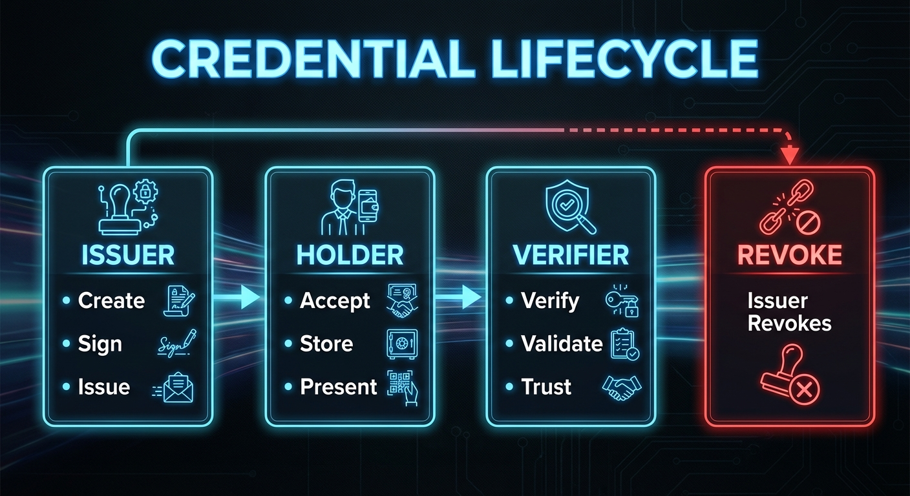

### 9.3 Privacy Features

**Encryption**
- Credentials can be encrypted for specific recipients
- Only the intended holder can decrypt and access
- Presentations re-encrypt a credential for a single verifier

**Bound Credentials**
- Credentials can be cryptographically bound to subjects
- Prevents credential transfer between identities
- Verifiers can confirm binding integrity

---

## 10. Cryptographic Foundation

### 10.1 Key Management

**Hierarchical Deterministic Wallets (BIP-32)**
```
Master Seed (BIP-39 Mnemonic)
        │
        └── m/44'/0'/{account}'        one hardened account per identity
                  │
                  ├── .../0/{index}    signing key (change = 0)
                  │                    rotation advances the index (§8.8)
                  │
                  ├── .../1'/0'        X25519 key agreement for DIDComm v2
                  │                    (SLIP-0010 Ed25519, converted)
                  │
                  └── .../2'/0'        Ed25519 assertion key (SLIP-0010)
                                       for Data Integrity credential proofs
```

Each identity occupies its own hardened account. Signing keys live on the `change = 0` branch and are indexed, so key rotation advances to the next index rather than deriving from a new account. Keys on other curves derive from the same BIP39 seed through **SLIP-0010**, which seeds each curve's master node with a different HMAC key so no curve can reproduce another's material. Those paths are hardened throughout, as SLIP-0010 requires for Ed25519, and the level below the account separates key types: `1'` for key agreement, `2'` for assertion. The X25519 key-agreement key used for DIDComm v2 messaging is derived as an Ed25519 key and converted, which is the relationship `did:key` defines between a `z6Mk` verification key and the key agreement key it resolves to. Because the derivation is standard rather than Archon-specific, any SLIP-0010 wallet given the mnemonic and the path arrives at the same keys. Both are deterministic from the seed: a given account and index always regenerate the same keys, so the messaging key needs no backup of its own. Recovery builds on the same property. The wallet's seed bank is a DID whose creation operation is itself derived from the seed, so it resolves to the same identifier every time — a controller who has taken a wallet backup can therefore restore every identity from the mnemonic alone, with no DID, file, or other material to keep alongside it. What the mnemonic cannot do is reconstruct identities that were never backed up: key regeneration is deterministic, but the mapping from name to DID, account and key index lives in wallet metadata and comes back only from a published backup.

**Key Types:**
- **ECDSA secp256k1**: Signs DID operations and credentials
- **Ed25519**: Optional credential assertion key for `eddsa-jcs-2022` proofs
- **X25519**: Key agreement for DIDComm v2 messaging
- **JWK format**: Standardized key representation
- **AES-256-GCM**: Symmetric encryption for wallets at rest and for encrypted messages; DIDComm envelopes also support A256CBC-HS512 and XC20P

### 10.2 Signature Scheme

Operations are signed with a `DataIntegrityProof` using the `archon-ecdsa-secp256k1-jcs-2026` cryptosuite. The proof configuration is the proof without `proofValue`, and the signed digest covers both it and the operation:

```
digest = SHA256(
  SHA256(JCS(proof_configuration)) ||
  SHA256(JCS(operation_without_proof))
)
signature = ECDSA_sign(private_key, digest)   // 64-byte r || s
proofValue = base64url(signature)
```

Verification recomputes the digest and checks the signature against the key the proof names. Because the configuration is inside the signature, its `created` time and `proofPurpose` cannot be altered without breaking it. The legacy `EcdsaSecp256k1Signature2019` proofs signed `SHA256(JCS(operation))` alone; they remain valid for history anchored before the new suite, and nothing new is signed that way except the seed bank's deterministic create operation. The [DID scheme](scheme.md) specifies both suites.

### 10.3 Content Addressing

DIDs are derived from content addresses:

```
operation = create_operation(public_key, registry, ...)
canonical = json_canonicalize(operation)
cid = IPFS_add(canonical)  # CIDv1, base32
did = "did:cid:" + cid
```

This creates a self-certifying identifier: the DID itself proves the integrity of the creation operation.

---

## 11. Network Topology

### 11.1 Node Types

**Full Nodes**
- Run complete Gatekeeper with local database
- Participate in all supported registries
- Validate and store all operations
- Provide resolution services

**Light Clients**
- Connect to trusted full nodes
- Perform wallet operations locally
- Delegate resolution to full nodes
- Suitable for browsers and mobile

**Registry Nodes**
- Specialized mediator nodes
- Focus on specific registry synchronization
- May run blockchain full nodes

**Tor Hidden Service Nodes**
- Expose Drawbridge API as a `.onion` address
- Enable fully anonymous identity operations
- Protect both client and server network identity
- Particularly relevant for censorship-resistant use cases

### 11.2 Peer Discovery

**Hyperswarm DHT**
- Nodes announce presence on topic-based DHT
- Peers discover each other without central coordination
- Encrypted connections established via noise protocol

**IPFS Network**
- Content retrieval via IPFS libp2p, addressed by CID
- A CID verifies the integrity of what it returns; it does not guarantee that anyone still holds it
- Availability depends on some node continuing to hold the operation and serve it; a node that validates an operation stores it in its own database, while pinning it to IPFS is a separate and configurable step
- No node is privileged for content access, so any node that holds an operation and serves it can satisfy a request

### 11.3 Synchronization

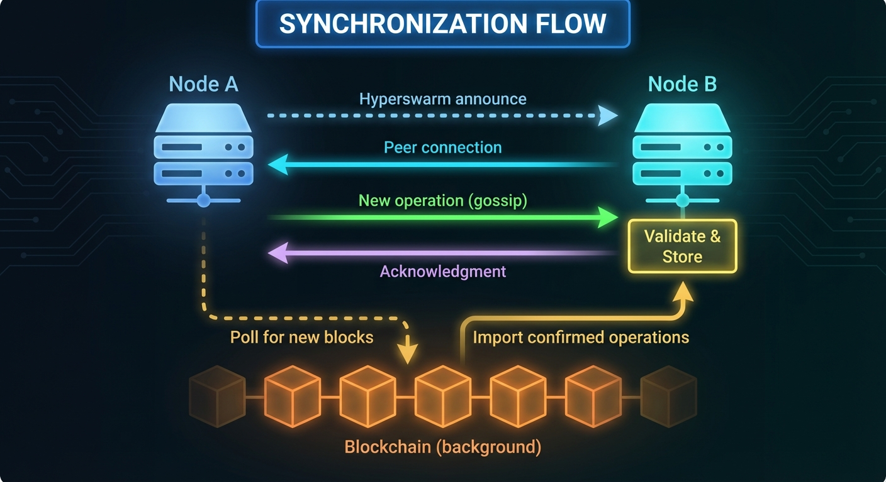

---

## 12. Use Cases

### 12.1 Self-Sovereign Identity

Individuals create and control their own digital identities without relying on any central authority:

- Generate identity locally using Keymaster
- Choose appropriate registry based on needs
- Hold credentials from multiple issuers
- Present credentials selectively to verifiers
- Recover identity using mnemonic seed phrase

### 12.2 Enterprise Identity Management

Organizations deploy Archon for decentralized employee and partner identity:

- Issue employee credentials upon onboarding
- Revoke credentials upon termination
- Enable passwordless authentication
- Audit credential usage and access

### 12.3 Educational Credentials

Universities and certification bodies issue verifiable credentials:

- Degrees and diplomas as verifiable credentials
- Professional certifications with expiration
- Micro-credentials for specific skills
- Instant verification by employers

### 12.4 IoT Device Identity

Connected devices receive unique, verifiable identities:

- Device attestation through manufacturer credentials
- Secure device-to-device authentication
- Supply chain provenance tracking
- Firmware update verification

### 12.5 Voting and Governance

Organizations implement transparent voting systems:

- Ballots readable only by the poll owner and the voter
- Eligibility defined by vault membership
- Tallies published to members, with or without individual ballots
- Deadlines and results recorded in signed, versioned DIDs

### 12.6 Micropayments and API Monetization

Node operators monetize identity services using Lightning micropayments:

- DID registration and updates as a paid service (fractions of a cent per operation), while resolution stays free
- Relays and other node services with per-request pricing
- Anonymous API access without accounts or payment processors
- Content creators receive tips and zaps directly to their DID
- Machine-to-machine payments for automated identity workflows

### 12.7 Digital Asset Provenance

Track ownership and authenticity of digital assets:

- Digital art authentication
- Document signing and notarization
- Supply chain tracking
- Intellectual property registration

### 12.8 AI Agents

Autonomous and semi-autonomous AI agents need durable identities, scoped authority, and auditable action histories:

- Assign each agent a DID with verifiable keys, service endpoints, and owner/controller metadata
- Issue credentials for capabilities, model provenance, organization membership, and delegated authority
- Authorize actions through challenge-response flows instead of long-lived shared secrets
- Record important decisions, tool invocations, and policy updates as signed DID-linked assets
- Use Lightning payments and L402 for agent-to-agent service calls, paid API access, and metered compute
- Rotate or revoke compromised agent keys without losing the agent's identity history

---

## 13. Comparison with Existing Solutions

### 13.1 Feature Comparison

| Feature | did:cid (Archon) | did:btcr | did:webvh | did:key |
|---------|------------------|---------|---------|---------|
| Creation Cost | No registry fee (Hyperswarm) | On-chain transaction fee | No registry fee | No registry fee |
| Creation Speed | Instant | Minutes | Instant | Instant |
| Update Support | Yes | Yes | Yes | No |
| Decentralized | Full | Full | Partial | Full |
| Finality Options | Multiple | Strong | Optional witnesses | N/A |
| Credential Support | Full | Limited | Full | Limited |
| Key Recovery | BIP-39 | Varies | Optional pre-rotation | N/A |
| Arbitrary Data Storage | Yes (didDocumentData) | External only | External only | No |
| Blockchain Timestamps | Automatic (with bounds) | Implicit | No | No |
| Time-Travel Resolution | Yes | No | Yes | No |
| Built-in Messaging | Yes (D-Mail, DIDComm v2) | No | No | No |
| Lightning Payments | Yes (L402 + Zaps) | No | No | No |
| API Monetization | Yes (L402) | No | No | No |
| Tor Hidden Services | Yes | No | No | No |
| Voting/Governance | Yes | No | No | No |

The graded entries above — "Full", "Partial", "Strong", "Limited", "Multiple", "Varies" — are the authors' qualitative reading of each method's published specification at the time of writing, not measured results, and the columns for other methods summarize their specifications rather than any particular implementation. Cost rows state registry fees only; they exclude the cost of operating or reaching a node, and any domain or hosting a method requires. Readers comparing methods for a specific deployment should consult each method's specification directly.

### 13.2 Architectural Comparison

**did:btcr**
- Anchors DID state directly to Bitcoin transactions, an update being made by spending the current output
- Strong finality, but creation and updates inherit Bitcoin fee and confirmation constraints
- The DID document is referenced by a URL in the transaction's `OP_RETURN` rather than stored on chain, so the document's availability rests off chain even though its ordering does not
- Registered in the W3C DID method registry, though the specification has remained a Community Group draft since 2019

**did:ion**
- Uses the Sidetree protocol to batch many DID operations into periodic Bitcoin anchors
- Reduces per-operation chain cost compared with direct on-chain methods
- Still depends on Bitcoin anchor cadence for finality

**did:webvh**
- `did:web` plus a verifiable history: every DID document version is chained to its predecessor and to a self-certifying identifier embedded in the DID, so the log of updates can be verified rather than trusted
- Still resolved through DNS and HTTPS, so control ultimately rests on the domain
- Offers optional pre-rotation keys and optional witness approval of updates, but no external anchor, so ordering is attested by the log and its witnesses rather than by a chain
- Entries here follow the did:webvh v1.0 specification published by the Decentralized Identity Foundation; it supersedes did:web, which it remains backwards compatible with

**did:key**
- Simple, deterministic from public key
- No update capability
- Limited to ephemeral use cases

**did:cid (Archon)**
- Instant creation with no registry fee on Hyperswarm
- Optional blockchain anchoring for updates, at that registry's fee and confirmation time (§3.2)
- Lets a controller choose the finality and cost trade-off per identity rather than inheriting one

---

## 14. Future Directions

### 14.1 Protocol Evolution

**Multi-Signature Support**
- Threshold signatures for organizational control
- Social recovery mechanisms
- Escrow and time-locked operations

**Zero-Knowledge Proofs**
- Selective disclosure without revealing full credentials
- Anonymous credential verification
- Privacy-preserving age/attribute verification

**Cross-Network Identity**
- Federated identity across networks
- Wider interoperability with other DID methods, building on the `eddsa-jcs-2022` credential proofs other methods can already verify

A DID can already migrate between registries, including between blockchains, with a signed update.

### 14.2 Ecosystem Development

**Schema Registry**
- Standardized credential schemas
- Industry-specific schema packages
- Automated schema validation

**Trust Frameworks**
- Governance frameworks for issuer accreditation
- Trust registries for verifier policies
- Reputation systems for identity providers

### 14.3 Performance Optimization

**Layer 2 Scaling**
- Rollup techniques beyond today's per-transaction operation batches
- State channels for high-frequency updates
- Optimistic confirmation with dispute resolution

---

## 15. Conclusion

Archon represents a significant advancement in decentralized identity technology. By separating identity creation from updates and supporting multiple registry options, it solves the fundamental tension between decentralization, cost, and speed that has limited previous approaches.

Key innovations include:

1. **Zero-cost, instant identity creation** through IPFS content addressing
2. **Flexible finality options** via multi-registry architecture
3. **The didDocumentData extension** enabling arbitrary application data bound to identities
4. **Automatic blockchain timestamping** providing cryptographic proof of when operations occurred
5. **Time-travel resolution** allowing DIDs to be resolved at any point in their history
6. **Decentralized messaging (D-Mail)** built on the identity layer
7. **Lightning Network integration** enabling instant DID-to-DID payments and zaps
8. **L402 API monetization** allowing node operators to offer paid identity services without accounts
9. **Member polls** with encrypted ballots and tallies that can omit individual votes
10. **Encrypted vaults** for shared storage, with optional secret member lists
11. **DIDComm v2 messaging** with a store-and-forward relay that cannot read what it holds
12. **Tor hidden service support** for censorship-resistant, anonymous access
13. **Full W3C compliance** ensuring ecosystem interoperability
14. **VC 2.0 credentials** with Data Integrity proofs that other DID methods can verify
15. **Machine-checked convergence proofs** in Lean showing that nodes holding the same evidence reconstruct the same DID histories

The protocol is production-ready, with interchangeable TypeScript and Rust Gatekeepers, TypeScript and Python Keymasters, multiple clients (CLI, web, mobile, browser extension, and an MCP server for AI agents), a Lightning-enabled API gateway (Drawbridge), a name service (Herald), robust cryptographic foundations, and extensive testing. Organizations seeking to implement decentralized identity infrastructure will find Archon provides the flexibility, security, and performance required for diverse use cases.

As the digital identity landscape continues to evolve, Archon's modular architecture positions it to adapt to new requirements while maintaining backward compatibility and the core principles of user sovereignty and decentralization.

---

## References

1. W3C Decentralized Identifiers (DIDs) v1.0. https://www.w3.org/TR/did-core/
2. W3C Verifiable Credentials Data Model v2.0. https://www.w3.org/TR/vc-data-model-2.0/
3. IPFS Content Identifiers (CIDs). https://docs.ipfs.tech/concepts/content-addressing/
4. BIP-32: Hierarchical Deterministic Wallets. https://github.com/bitcoin/bips/blob/master/bip-0032.mediawiki
5. BIP-39: Mnemonic code for generating deterministic keys. https://github.com/bitcoin/bips/blob/master/bip-0039.mediawiki
6. Hyperswarm Protocol. https://docs.holepunch.to/building-blocks/hyperswarm
7. JSON Canonicalization Scheme (JCS). RFC 8785
8. W3C Verifiable Credential Data Integrity 1.0. https://www.w3.org/TR/vc-data-integrity/
9. W3C Data Integrity EdDSA Cryptosuites v1.0. https://www.w3.org/TR/vc-di-eddsa/
10. SLIP-0010: Universal private key derivation from master private key. https://github.com/satoshilabs/slips/blob/master/slip-0010.md
11. DIF DIDComm Messaging v2.1. https://identity.foundation/didcomm-messaging/spec/v2.1/

---

## Appendix A: Quick Start

### Creating Your First Identity

```bash
# Initialize wallet with new seed phrase
./archon create-wallet

# Create a new identity
./archon create-id alice

# Resolve the current identity
./archon resolve-id

# Back up wallet to file
./archon backup-wallet-file wallet-backup.json
```

---

*Copyright 2026 Archetech. Released under MIT License.*
