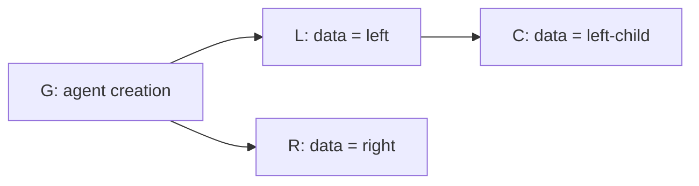

# Convergence investigation — #1195

## Result

The unrestricted claim “the same operations produce the same accepted history,
regardless of delivery order” is false for current Hyperswarm behavior. Both
Gatekeepers reproduce it through ordinary batch import and event processing with
real, modern-suite signatures. The fixtures use synthetic keys; no production
services or storage are involved.

This is an investigation and executable model, not a protocol change or a Lean
proof. The tests intentionally record existing divergence rather than silently
introducing a new branch-selection rule.

## Minimal signed history

A self-controlled agent signs two data-only updates, `L` and `R`, referencing the
same creation operation `G`. Another update `C` references `L`. No delegation,
invalid signature, controller cycle, legacy proof, or missing operation is needed.
Proof times are fixed and increasing: G at second 0, L at 1, R at 2, C at 3.



| Delivery order | Hyperswarm fresh receipts | Hyperswarm identical tied envelopes |
| --- | --- | --- |
| G, L, R, C | G → L → C | G → L → C |
| G, R, L, C | G → R | G → R |
| L, G, R, C | G → L → C | G → R |

“Fresh receipts” assigns increasing ordinals in delivery order, as the Hyperswarm
mediator does with `[Date.now(), batchIndex]`. The signed operations and proof
times are identical across nodes, but their receipt ordinals are not. Earlier
proof time does not make L win against R: proof time selects historical cutoffs,
not the competing-branch winner.

“Tied envelopes” assigns `[1000, 0]` to every event, unchanged across permutations.
Gatekeeper accepts these envelopes; the mediator can also assign equal ordinals
to separate one-operation batches received in the same millisecond. No unique
sequence number is enforced across those batches. Even identical event evidence
therefore does not establish arrival-order independence. The timestamp value is
synthetic and has no cryptographic significance.

The third row exposes why “first received wins” is not a complete model for ties:
L initially lacks its predecessor. During replay, G becomes available before R
is visited; R is accepted, and the tied ordinal does not let L replace it in a
later pass. These three tied-envelope traces are explicit counterexamples, not
claims that the restricted model covers every tie or every delivery permutation.

Repeated batch delivery and restart-style reconstruction preserve each observed
result. Every input operation remains in the candidate journal, including losing
branches. Restart here means fresh Gatekeeper caches backed by the retained
in-memory database (TS) or its serialized snapshot (Rust), not a physical disk
or Redis restart test.

## Executable model and scope

[model.mjs](../../tests/convergence/model.mjs) is a small graph projection: start
at genesis and repeatedly select the highest-priority available child. It neither
calls Gatekeeper nor reproduces signature verification. Its domain is a single
self-controlled agent with valid data-only updates, an unchanged key, one registry,
and an acyclic predecessor graph. The ordinary importers independently verify
all accepted signatures using the shared fixtures.

For distinct fixed ordinals, priority is independent of delivery order. For fresh
Hyperswarm receipts, priority follows delivery order. Tied ordinals are excluded
from this model and tested separately as described above.

[The deterministic generator](../../tests/convergence/generate-vectors.mjs)
emits [signed fixtures and expected paths](../../tests/convergence/vectors.json).
The TS tests independently recompute model paths and enumerate all permutations
for each modeled scenario. Rust consumes the same expected paths. Both compare
canonical accepted operation IDs and verified, confirmed resolution, and check
that candidates survive.

| Scenario | Delivery orders tested per port | Distinct final histories |
| --- | ---: | ---: |
| Hyperswarm, linear chain, fresh receipt ordinals | 6 | 1 |
| Hyperswarm, competing branches, fresh receipt ordinals | 24 | 2 |
| Hyperswarm, linear chain, fixed distinct ordinals | 6 | 1 |
| Hyperswarm, competing branches, fixed distinct ordinals | 24 | 1 |
| Hyperswarm, competing branches, fixed tied ordinals | 3 selected traces | 2 |
| BTC:signet, linear chain, fixed distinct anchors | 6 | 1 |
| BTC:signet, competing branches, fixed distinct anchors | 24 | 1 |

That is 93 delivery traces per port, checked after initial processing, repeated
batch delivery, and reconstruction. The BTC anchors use synthetic metadata at
the trusted Gatekeeper batch-import boundary; these tests do not verify blockchain
consensus, mediator discovery, CID fetching, or HTTP transport. No block-time bound
or asset/controller selection claim is inferred from the single-agent results.

## What could be proved next

A useful first Lean theorem would concern the restricted fixed-priority graph:
for a finite acyclic graph with one genesis and a common strict total priority,
projection terminates and is unchanged by permutation of the received evidence.
The graph model can establish that property independently of a delivery schedule.
It cannot establish that the complete Gatekeeper importer implements it.

A full Archon convergence theorem would additionally need:

- Exact definitions of evidence equality: canonical operations, distinct anchors,
  controller histories, cached predecessor aliases, and the same chain view.
- A delivery-independent rule for every competing branch in the theorem's scope,
  or an explicit restriction excluding ambiguous unanchored forks.
- Replay termination and equivalence between incremental imports and reconstruction,
  including late controller history, migrations, transfers, and reorganization.
- Explicit treatment of locally removed/expired evidence and identical resolution
  bounds; compare protocol state rather than node-local retrieval metadata.
- A refinement argument connecting the formal model to both implementations.
  Shared tests provide evidence of agreement, not that proof.

Even an anchored-asset theorem must account for Hyperswarm controller dependencies;
anchoring the asset alone does not remove every unanchored ordering decision.
Nothing here selects a new tie-breaker, changes the proof-time policy, or adds a
quarantine/oscillation safeguard. That requires a separate protocol decision.

## Reproduction and validation

From the repository root, with normal project dependencies installed:

```sh
# After building the Cipher and IPFS packages; rewrites deterministic fixtures.
node tests/convergence/generate-vectors.mjs
node --experimental-vm-modules node_modules/.bin/jest tests/gatekeeper/convergence.test.ts --runInBand --coverage=false
cargo test --manifest-path rust/services/gatekeeper/Cargo.toml convergence_delivery
```

Both port checks passed. Root typechecking and lint passed (lint retains two
existing warnings). Fixture regeneration and `git diff --check` were checked.
Only test code and documentation changed; live nodes were not modified.
