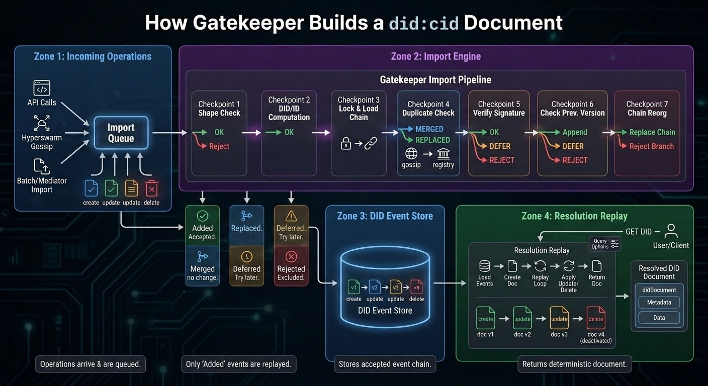

# Gatekeeper Operation Import and DID Resolution Infographic Brief

## Title

**How Gatekeeper Builds a `did:cid` Document**

The infographic should show two distinct phases:

1. **Event import:** Gatekeeper receives operations from local clients,
   Hyperswarm gossip, batch imports, or registry mediators. This is where
   operations are accepted, merged, deferred, replaced, or rejected.
2. **DID resolution:** Gatekeeper loads the stored event chain and replays it
   into a deterministic DID document.

The key visual correction: validation gates belong primarily to **event
import**, not to the normal resolution path.



## 1. Overall Layout

Use a left-to-right flow with two large labeled regions:

```text
Incoming Operations -> Gatekeeper Import Pipeline -> DID Event Store -> Resolution Replay -> Resolved DID Document
```

Below the import pipeline, show three side outputs:

```text
Rejected
Deferred
Merged / Replaced
```

Keep the DID resolution side visually calmer than the import side. It should
feel like replaying a clean event log, not re-litigating every operation.

## 2. Incoming Operations

On the far left, show several operation sources converging into Gatekeeper:

- `POST /api/v1/did`
- Hyperswarm `queue` / `batch`
- `/api/v1/dids/import`
- `/api/v1/batch/import`
- `/api/v1/batch/import/cids`
- Bitcoin/Satoshi mediator import

Represent the incoming stream as signed operation cards:

```text
create
update
update
delete
```

Each card should carry small metadata chips:

```text
registry
time
ordinal
opid
proof
previd
```

Caption:

```text
Operations arrive from clients, peer gossip, batch imports, and registry mediators.
```

## 3. Import Queue

Show a queue box labeled:

```text
Import Queue
```

Inside it, show operations waiting to be processed.

Important callout:

```text
Shape checks and duplicate detection happen before events enter or drain from the queue.
```

Small pseudocode callout:

```text
verify event shape
drop duplicate proofValue per registry
queue for processEvents()
```

## 4. Gatekeeper Import Pipeline

This is the main visual centerpiece. Show an operation moving through
import-time decision gates. Each gate should have green, amber, blue, or red
outputs.

### Gate 1: Event Shape

Checks:

```text
valid registry
valid time
operation present
operation <= 64 KB
proof format valid
type in create/update/delete
```

Outputs:

- Green: continue
- Red: reject

### Gate 2: DID and Operation ID

Show Gatekeeper computing or filling:

```text
event.did
event.opid = cid(operation)
```

For create operations, `event.did` is generated from the operation CID. For
update/delete operations, `event.did` comes from `operation.did`.

Output:

- Green: continue

### Gate 3: Per-DID Lock and Current Chain

Show Gatekeeper acquiring a lock and loading the current chain:

```text
current = store.get_events(did)
```

Caption:

```text
Per-DID import is serialized so competing updates see the current chain.
```

### Gate 4: Duplicate / Registry Upgrade

Checks:

```text
same proof.proofValue already exists?
```

Outputs:

- Blue: `MERGED` if the existing event is already on the expected registry
- Green: `REPLACED` if this event confirms the same operation on the expected registry
- Blue: `MERGED` if it is a harmless duplicate from another path

Visual detail:

Show a local or gossip event being replaced by a later confirmed registry
event for the same operation.

### Gate 5: Operation Verification

Checks:

```text
verifyOperation(operation)
```

For `create`:

- Validate `created`, `registration`, type, registry, proof format.
- Agent: verify `#key-1` proof against `publicJwk`.
- Asset: resolve controller at `proof.created`, verify controller signature.

For `update` / `delete`:

- Resolve target DID.
- Reject deactivated DIDs.
- Resolve controller when the DID is an asset.
- Verify signature against the resolved key.
- Check target registry support.

Outputs:

- Green: continue
- Amber: `DEFERRED` if the controller or previous dependency is not imported yet
- Red: `REJECTED` if invalid

Important label:

```text
Most cryptographic and controller checks happen at import time.
```

### Gate 6: Previous Version Link

For non-create operations, check:

```text
operation.previd
current event with opid == operation.previd
```

Outputs:

- Green: append if `previd` points to current chain tip
- Amber: `DEFERRED` if the previous event has not arrived yet
- Red: `REJECTED` if missing or incompatible

### Gate 7: Reorg / Earlier Ordinal

When `previd` points into the middle of the current chain, show a decision:

```text
expected registry?
earlier ordinal than next event?
```

Outputs:

- Green: replace the rest of the chain with the imported event
- Red: reject stale or losing branch

Caption:

```text
Registry ordering can replace a previously stored branch when the new event is the expected confirmed event.
```

## 5. Import Outcomes

Below the import pipeline, show four outcome bins:

### Added

```text
Accepted into DID event store.
```

Examples:

- New create operation
- Valid update extending current tip
- Confirmed registry event replacing an unconfirmed event

### Merged

```text
Already represented; no chain change.
```

Examples:

- Duplicate operation received through gossip
- Same proof already present on expected registry

### Deferred

```text
Try again later.
```

Examples:

- Controller DID not imported yet
- `previd` not imported yet
- Dependency may arrive from peer sync or registry import

### Rejected

```text
Does not enter the active event chain.
```

Examples:

- Bad proof
- Malformed operation
- Unsupported registry
- Missing `previd`
- Stale branch
- Invalid DID/controller relationship

Important visual implication:

```text
Rejected operations are excluded during import. Resolution normally sees the accepted event chain.
```

## 6. DID Event Store

In the center, show a database cylinder labeled:

```text
DID Event Store
```

Inside, show the resulting accepted chain:

```text
v1 create -> v2 update -> v3 update -> v4 delete
```

Each stored event card should include:

```text
opid
registry
time
ordinal
operation
```

Caption:

```text
The store contains the event sequence Gatekeeper will replay for resolution.
```

## 7. Resolution Request

On the resolution side, show a user/client/API call:

```text
GET /api/v1/did/:did
```

Below it, show optional query toggles:

```text
versionTime
versionSequence
confirm=true
verify=true
```

Caption:

```text
Resolution reads the stored event chain and materializes a DID document.
```

## 8. Resolution Replay

Show the resolution path as a replay loop over the accepted event chain:

```text
load events
generate initial document from create
for each stored event:
  stop at versionTime or versionSequence
  apply update/delete
return document
```

The normal path should not show red rejection gates. Instead, show a clean
document builder:

```text
create -> doc v1 -> update -> doc v2 -> update -> doc v3 -> delete -> deactivated doc v4
```

For the create event:

- Agent DID creates `verificationMethod`, `authentication`, and
  `assertionMethod`.
- Asset DID creates `controller` and `didDocumentData`.

For update events:

```text
merge didDocument
replace didDocumentData if present
replace didDocumentRegistration if present
versionId = opid
updated = event.time
```

For delete events:

```json
{
  "didDocument": { "id": "did:cid:..." },
  "didDocumentMetadata": {
    "deactivated": true
  },
  "didDocumentData": {}
}
```

## 9. Resolution-Time Options

Show these as small overlays on the replay loop, not as the main validation
pipeline:

### `versionTime` / `versionSequence`

```text
Stop replay at requested historical point.
```

### `confirm=true`

```text
Stop before unconfirmed events when the confirmed chain is requested.
```

### `verify=true`

```text
Re-check signatures and previd while replaying; throw if invalid.
```

Important label:

```text
Resolution may verify again when requested, but import is where operations are accepted, deferred, merged, replaced, or rejected.
```

## 10. Final Output: DID Resolution Result

On the far right, show a polished output card labeled:

```text
Resolved DID Document
```

Include four sibling compartments:

```json
{
  "didDocument": {},
  "didDocumentMetadata": {},
  "didDocumentData": {},
  "didResolutionMetadata": {}
}
```

Highlight key metadata fields:

```text
versionId
versionSequence
created
updated
deleted
deactivated
confirmed
retrieved
```

Caption:

```text
Gatekeeper returns the deterministic document state produced by replaying the stored event chain.
```

## 11. Suggested Visual Layout

Use four horizontal zones:

1. **Incoming operations**
   Sources -> signed operations -> import queue

2. **Import and merge engine**
   Shape checks -> duplicate/registry upgrade -> proof/controller checks ->
   previous-version checks -> added/merged/deferred/rejected

3. **Accepted event store**
   Materialized per-DID event chain

4. **Resolution replay**
   API request -> replay accepted chain -> final DID document

The strongest visual metaphor is:

```text
Import validates the log. Resolution replays the log.
```

## 12. Color Semantics

Use restrained technical colors:

- Blue: incoming sources, event store, merged duplicates
- Green: added/accepted events and applied replay steps
- Amber: deferred dependencies and historical stop points
- Red: rejected operations
- Purple or dark gray: Gatekeeper import/resolution logic
- White or light card: final DID document

Avoid making the whole thing look like generic blockchain art. It should feel
more like a distributed systems diagram.

## 13. Key Callout Text

Use these as small callout bubbles:

- Import validates the operation before it joins the DID chain.
- Resolution replays the accepted event chain.
- Deferred operations may succeed after dependencies arrive.
- Duplicate gossip is merged, not applied twice.
- Registry-confirmed events can replace earlier unconfirmed versions.
- `versionTime` and `versionSequence` stop replay at a historical point.
- `verify=true` re-checks signatures during resolution.
- Delete is terminal and returns `deactivated: true`.

Bottom caption:

```text
Gatekeeper builds DID documents in two phases: first it imports operations into a per-DID event chain by accepting, merging, deferring, replacing, or rejecting them; later it resolves a DID by replaying that stored chain into a deterministic DID document.
```
