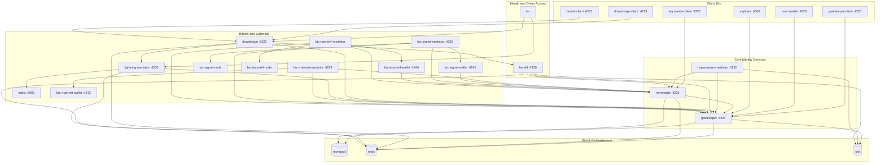
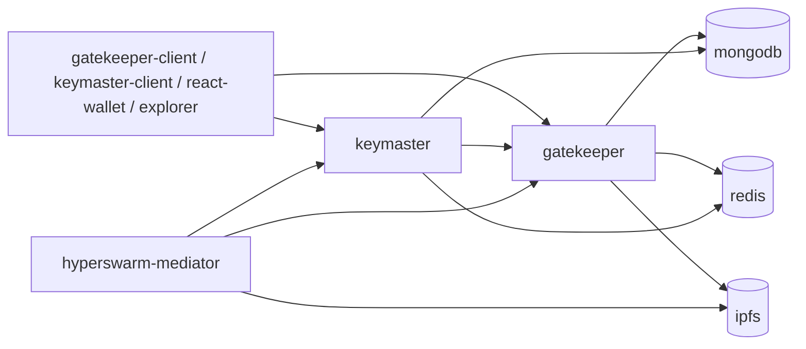
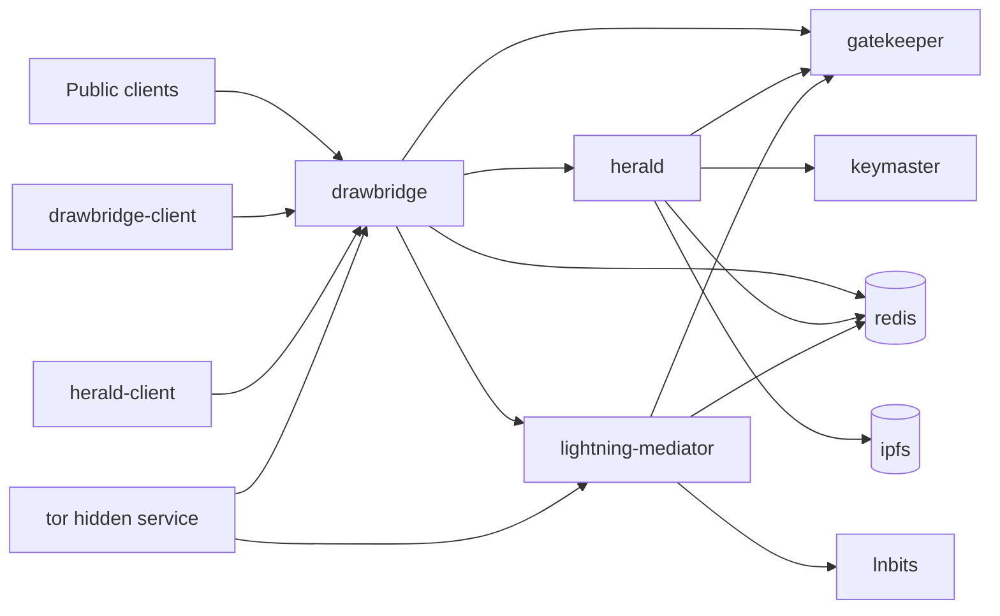
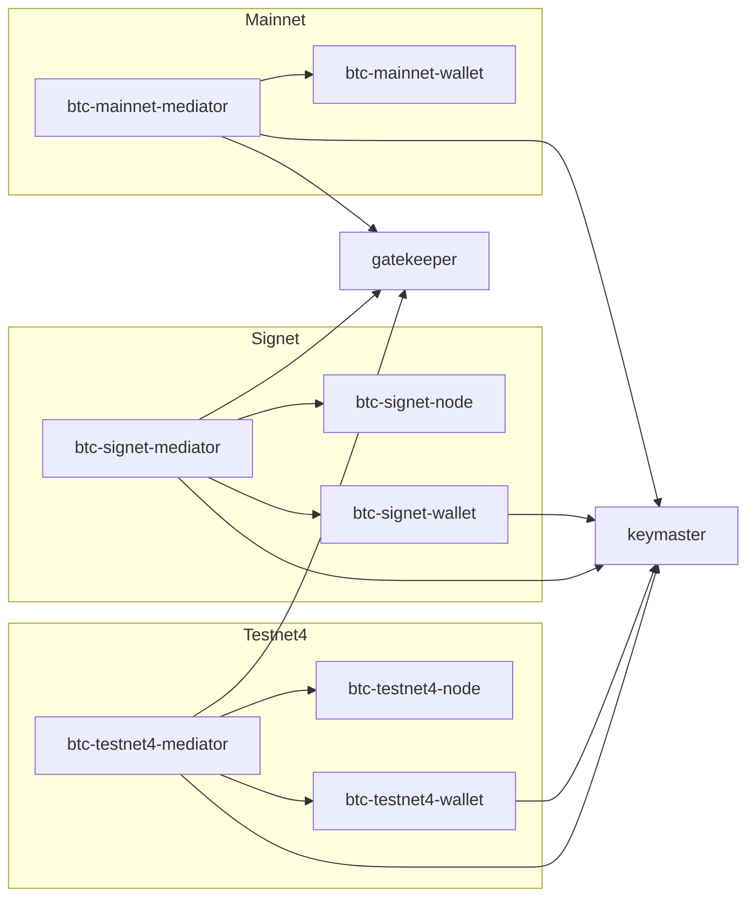

# Runtime Docker Container Architecture

This document describes the runtime container topology for the bundled Archon Docker Compose stack.

It focuses on long-running containers and their network relationships rather than build-time Dockerfiles.

## Full Runtime Topology

## Core Identity Path

## Drawbridge, Herald, and Lightning

## Bitcoin Runtime Containers

## Notes

- `drawbridge` is the public API gateway for Herald naming routes, L402 flows, and Lightning proxying.
- `lightning-mediator` owns LNbits access and Lightning wallet operations.
- `keymaster` and `gatekeeper` remain the core identity/runtime services for DID and wallet operations.
- Bitcoin support is split into per-network wallet containers plus matching mediators.
- `tor` publishes the Drawbridge onion service and gives the Lightning stack a SOCKS proxy path for onion-based Lightning endpoints.
