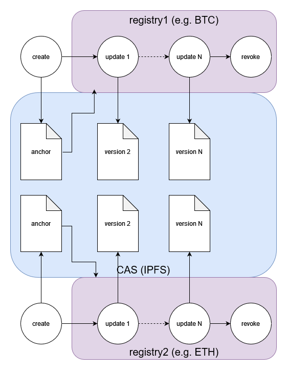

# The `did:cid` Method Specification


## Abstract

The `did:cid` method specification conforms to the requirements specified in [DID Core 1.0](https://www.w3.org/TR/did-core/), a W3C Recommendation. For more information about DIDs and DID method specifications, please see the [DID Primer](https://w3c-ccg.github.io/did-primer/).

## Introduction

The `did:cid` method is designed to support a P2P identity layer with secure decentralized [verifiable credentials](https://www.w3.org/TR/vc-data-model-2.0/). DIDs created using this method are used for agents (e.g., users, issuers, verifiers, and nodes) and assets (e.g., verifiable credentials, verifiable presentations, schemas, challenges, and responses).

## DID Format

A `did:cid` DID has the following format:

```
did-cid        = "did:cid:" cid-identifier
cid-identifier = CID v1 in standard base32 encoding
```

### Example

`did:cid:bafkreiawdmk6fmqc5p237vffyctazpzdgvgqfdj2i3hx2idtodxkwhyj5m`

### DID URL Syntax

A `did:cid` DID URL extends the DID with the standard URI components defined by the W3C [DID Core 1.0](https://www.w3.org/TR/did-core/#did-url-syntax) DID URL grammar:

```
did-url = did-cid path-abempty [ "?" query ] [ "#" fragment ]
```

| Component | Purpose in `did:cid` |
|-----------|----------------------|
| `path` (`/…`) | Selects a method-specific dereferenceable resource of the DID. This method defines `/data` and `/registration` (see [DID URL Dereferencing](#did-url-dereferencing)). |
| `query` (`?…`) | Selects a version to resolve or dereference. This method honors `versionTime` and `versionSequence`. |
| `fragment` (`#…`) | Identifies a node within the DID document (e.g. `#key-1`), resolved client-side against the resolved document. |

> **Note (DID Core 1.0):** Earlier drafts of the DID specification allowed a `;`-delimited service matrix parameter (`did:cid:<cid>;service=…`). DID Core 1.0 removed this form; service selection, where supported, uses the registered `service` and `relativeRef` **query** parameters. The `did:cid` method does not use the `;service` matrix-parameter form.

## DID Lifecycle



All `did:cid` DIDs begin life anchored to IPFS. Once created they can be used immediately by any application or service connected to a node. Subsequent updates to the DID (meaning that a document associated with the DID changes) are registered on a registry such as a blockchain (BTC, ETH, etc) or a decentralized database (e.g. hyperswarm). The registry is specified at DID creation so that nodes can determine which single source of truth to check for updates.

The *key concept of this design* is that DID creation is decentralized through IPFS, and DID updates are decentralized through the registry specified in the DID creation. The DID is decentralized for its whole lifecycle, which is a hard requirement of DIDs.

## DID Creation

DIDs are anchored to IPFS prior to any declaration on a registry. This allows DIDs to be created very quickly (less than 10 seconds) and at (virtually) no cost.

The `did:cid` method supports two main types of DID Subject: **agents** and **assets**. Agents have keys and control assets. Assets do not have keys, and are controlled by a single agent (the owner of the asset). The two types have slightly different creation methods.

### Agents

To create an agent DID, the client must sign and submit a "create" operation to a node. This operation will be used to anchor the DID in IPFS.

1. Generate a new private key
    1. We recommend deriving a new private key from an Hierarchical Deterministic (HD) wallet (BIP-32).
1. Generate a public key from the private key
1. Convert to JWK (JSON Web Key) format
1. Create an operation object with these fields in any order:
    1. `type`  must be "create"
    1. `registration` metadata includes:
        1. `version`  number, e.g. 1
        1. `type`  must be "agent"
        1. `registry`  (from a list of valid registries, e.g. "BTC", "hyperswarm", etc.)
    1. `publicJwk` is the public key in JWK format
    1. `created` time in ISO format
    1. `blockid` [optional] current block ID on registry (if registry is a blockchain)
1. Sign the JSON with the private key corresponding to the public key (this enables the node to verify that the operation is coming from the owner of the public key)
    - The `proof.verificationMethod` must be set to `#key-1` (a relative reference) since the DID does not yet exist
1. Submit the operation to a node. For example, with a REST API, post the operation to the node's endpoint to create new DIDs (e.g. `/api/v1/did/`)

Example
```json
{
    "type": "create",
    "created": "2026-01-14T19:29:06.924Z",
    "registration": {
        "version": 1,
        "type": "agent",
        "registry": "hyperswarm"
    },
    "publicJwk": {
        "kty": "EC",
        "crv": "secp256k1",
        "x": "LRrQabMIkvGVTA2IRk0JdWCpu57MNGm89nugrBZHo24",
        "y": "KHsWAaidAIGCosDjRYDIk-94793e4xVEL4UwFxjWgB8"
    },
    "proof": {
        "type": "EcdsaSecp256k1Signature2019",
        "created": "2026-01-14T19:29:06.927Z",
        "verificationMethod": "#key-1",
        "proofPurpose": "authentication",
        "proofValue": "qNT0EhtojDxOJBh71pddmWnMharQZJxOelW71ehFfuZqrqPls32zSP4bD2CyYNEvAXSJRA-3X5DwR1vHVyTPHw"
    }
}
```

Upon receiving the operation the node must:
1. Verify the proof
1. Apply JSON canonicalization scheme to the operation.
1. Pin the seed object to IPFS.

The resulting content address (CID) in standard CID v1 base32 encoding is used as the DID suffix. For example the operation above corresponds to CID "bafkreig6rjxbv2aopv47dgxhnxepqpb4yrxf2nvzrhmhdqthojfdxuxjbe" yielding the DID `did:cid:bafkreig6rjxbv2aopv47dgxhnxepqpb4yrxf2nvzrhmhdqthojfdxuxjbe`.

### Assets

To create an asset DID, the client must sign and submit a `create` operation to a node. This operation will be used to anchor the DID in IPFS.

1. Create an operation object with these fields in any order:
    1. `type`  must be "create"
    1. `registration` metadata includes:
        1. `version`  number, e.g. 1
        1. `type`  must be "asset"
        1. `registry`  (from a list of valid registries, e.g. "BTC", "hyperswarm", etc.)
    1. `controller` specifies the DID of the owner/controller of the new DID
    1. `data` can contain any data in JSON format, as long as it is not empty
    1. `created` time in ISO format
    1. `blockid` [optional] current block ID on registry (if registry is a blockchain)
1. Sign the JSON with the private key of the controller
    - The `proof.verificationMethod` must be the full DID reference of the controller (e.g., `did:cid:abc123#key-1`)
1. Submit the operation to a node. For example, with a REST API, post the operation to the node's endpoint to create new DIDs (e.g. `/api/v1/did/`)

Example
```json
{
    "type": "create",
    "created": "2026-01-14T19:32:24.354Z",
    "registration": {
        "version": 1,
        "type": "asset",
        "registry": "hyperswarm"
    },
    "controller": "did:cid:bagaaieradidcs4hohalzexldr5mdmbmt553tqq3ifqd56mvhifppvyfdc32q",
    "data": {
        "group": {
            "name": "testgroup",
            "members": []
        }
    },
    "proof": {
        "type": "EcdsaSecp256k1Signature2019",
        "created": "2026-01-14T19:32:24.375Z",
        "verificationMethod": "did:cid:bagaaieradidcs4hohalzexldr5mdmbmt553tqq3ifqd56mvhifppvyfdc32q#key-1",
        "proofPurpose": "authentication",
        "proofValue": "NGQMBq5venJ2i4F3-Uo0p_rEAlY0zr-YJeTTu7vUlZ0NfyqirIPISGGyy8KU-QrBvsCrfc0fsQm8sh-2BfAzqQ"
    }
}
```

Upon receiving the operation the node must:
1. Verify the proof is valid for the specified controller.
1. Apply JSON canonicalization scheme to the operation object.
1. Pin the seed object to IPFS.

For example, the operation above that specifies an empty Credential asset corresponds to CID "z3v8AuahaEdEZrY9BGfu4vntYjQECBvDHqCG3mPAfEbn6No7AHh" yielding a DID of `did:cid:z3v8AuahaEdEZrY9BGfu4vntYjQECBvDHqCG3mPAfEbn6No7AHh`.

## DID Update

A DID Update is a change to any of the documents associated with the DID. To initiate an update the client must sign an operation that includes the following fields:

1. Create an operation object with these fields in any order:
    1. `type` must be set to "update"
    1. `did` specifies the DID
    1. `doc` is set to the new version of the document set, which must include any or all of:
        1. `didDocument` the main document
        1. `didDocumentData` the document's data
        1. `didDocumentRegistration` the protocol spec
    1. `previd` the CID of the previous operation
    1. `blockid` [optional] current block ID on registry (if registry is a blockchain)
1. Sign the JSON with the private key of the controller of the DID
1. Submit the operation to a node. For example, with a REST API, post the operation to the node's endpoint to update DIDs (e.g. `/api/v1/did/`)

It is recommended the client fetches the current version of the document and metadata, makes changes to it, then submit the new version in an update operation in order to preserve the fields that shouldn't change.

Example update to rotate keys for an agent DID:
```json
{
    "type": "update",
    "did": "did:cid:bagaaieradidcs4hohalzexldr5mdmbmt553tqq3ifqd56mvhifppvyfdc32q",
    "previd": "bagaaieradidcs4hohalzexldr5mdmbmt553tqq3ifqd56mvhifppvyfdc32q",
    "doc": {
        "didDocument": {
            "@context": [
                "https://www.w3.org/ns/did/v1"
            ],
            "id": "did:cid:bagaaieradidcs4hohalzexldr5mdmbmt553tqq3ifqd56mvhifppvyfdc32q",
            "verificationMethod": [
                {
                    "id": "#key-2",
                    "controller": "did:cid:bagaaieradidcs4hohalzexldr5mdmbmt553tqq3ifqd56mvhifppvyfdc32q",
                    "type": "EcdsaSecp256k1VerificationKey2019",
                    "publicKeyJwk": {
                        "kty": "EC",
                        "crv": "secp256k1",
                        "x": "hrpjLquejw7lOE2RVGr1LQ315k0JI1lwlI4WI3t983k",
                        "y": "G2_-Agy95QnIFzW5sa9Ik72vDPeqJ0rqqrxWs3CM49o"
                    }
                }
            ],
            "authentication": [
                "#key-2"
            ],
            "assertionMethod": [
                "#key-2"
            ]
        }
    },
    "proof": {
        "type": "EcdsaSecp256k1Signature2019",
        "created": "2026-01-14T19:29:16.117Z",
        "verificationMethod": "did:cid:bagaaieradidcs4hohalzexldr5mdmbmt553tqq3ifqd56mvhifppvyfdc32q#key-1",
        "proofPurpose": "authentication",
        "proofValue": "LEmM9NGL3b4WBzSUZVy0GOqzZ16KbGydBWfCwRNTmZV-ZRznm9g_09xIszITyB3y2A3DYYYaRp5E_tFegZgBgQ"
    }
}
```

Upon receiving the operation the node must:
1. Verify the proof is valid for the controller of the DID.
1. Verify the previd is identical to the latest version's operation CID.
1. Record the operation on the DID specified registry (or forward the request to a trusted node that supports the specified registry).

For registries such as BTC with non-trivial transaction costs, it is expected that update operations will be placed in a queue, then registered periodically in a batch in order to balance costs and latency of updates. If the registry has trivial transaction costs, the update operation may be distributed individually and immediately. This method defers this tradeoff between cost, speed, and security to the node operators.

## DID Revocation

Revoking a DID is a special kind of Update that results in the termination of the DID. Revoked DIDs cannot be updated because they have no current controller, therefore they cannot be recovered once revoked. Revoked DIDs can be resolved without error, but resolvers will return a result with the `didDocumentMetadata.deactivated` property set to `true`. The `didDocument` is reduced to just its `id`, and the DID's data resource (dereferenced at `/data`) is empty.

To revoke a DID, the client must sign and submit a `delete` operation to a node.

1. Create an operation object with these fields in any order:
    1. `type`  must be "delete"
    1. `did` specifies the DID to be deleted
    1. `previd` the CID of the previous operation
    1. `blockid` [optional] current block ID on registry (if registry is a blockchain)
1. Sign the JSON with the private key of the controller of the DID
1. Submit the operation to a node. For example, with a REST API, post the operation to the node's DID endpoint (e.g. `POST /api/v1/did/`)


Example deletion operation:
```json
{
    "type": "delete",
    "did": "did:cid:bagaaiera7vfnrxrmcvo7prrbmdhpvusroii4y2gir252nzk4jv5nxgkzldha",
    "previd": "bagaaiera7vfnrxrmcvo7prrbmdhpvusroii4y2gir252nzk4jv5nxgkzldha",
    "proof": {
        "type": "EcdsaSecp256k1Signature2019",
        "created": "2026-01-14T19:34:32.170Z",
        "verificationMethod": "did:cid:bagaaieradidcs4hohalzexldr5mdmbmt553tqq3ifqd56mvhifppvyfdc32q#key-1",
        "proofPurpose": "authentication",
        "proofValue": "YUTouPmhHDSudPSJ9iU44HdzBYDm7cqmDmanhgDLa4A3MBNiJpbWL2Db4BbzDYQ4NjJCRDWixYZOT2ojzzBHI3c"
    }
}
```

Upon receiving the operation the node must:
1. Verify the proof is valid for the controller of the DID.
1. Verify the previd is identical to the latest version's operation CID.
1. Record the operation on the DID specified registry (or forward the request to a trusted node that supports the specified registry).

After revocation is confirmed on the DID's registry, resolving the DID returns a result like this:
```json
{
    "didDocument": {
        "id": "did:cid:bagaaiera7vfnrxrmcvo7prrbmdhpvusroii4y2gir252nzk4jv5nxgkzldha"
    },
    "didResolutionMetadata": {
        "retrieved": "2026-01-14T19:36:09.115Z"
    },
    "didDocumentMetadata": {
        "deactivated": true,
        "created": "2026-01-14T19:32:24Z",
        "deleted": "2026-01-14T19:34:33Z",
        "versionId": "bagaaierats6ttxvpx2l3tat25ota7z7335akfd2iup5loajsdlqcwismkgpq",
        "versionSequence": "2",
        "confirmed": true
    }
}
```

The metadata has a `deactivated` field set to `true` to conform to the [W3C specification](https://www.w3.org/TR/did-core/#did-document-metadata).

## DID Resolution

Resolution is the operation of returning a DID Document and its metadata for a given DID. It is distinct from *dereferencing*, which returns a resource identified by a DID URL (see [DID URL Dereferencing](#did-url-dereferencing)).

Given a DID and an optional resolution time, the resolver retrieves the associated document seed from IPFS using the DID suffix as the CID, parsing it as plaintext JSON.
If the data cannot be retrieved, then the resolver should delegate the resolution request to a fallback node.
Otherwise, if the data can be retrieved but is not a valid seed document, an error is returned immediately.
Once returned and validated, the resolver then evaluates the JSON to determine whether it is a known type (an agent or an asset). If it is not a known type an error is returned.

If we get this far, the resolver then looks up the DID's specified registry in its document seed. If the node does not support the registry (meaning the node is not actively monitoring the registry for updates), then it must forward the resolution request to a trusted node that does support the registry. If the node is not configured with any trusted nodes for the specified registry, then it must forward the request to a trusted fallback node to handle unknown registries.

If the node does support the specified registry, the resolver retrieves all update records from its local database that are keyed to the DID, and ordered by each update's ordinal key. The ordinal key is a set of values that can be used to sort the updates into chronological order. For example, the ordinal key for the BTC registry will be a tuple `{block index, transaction index, batch index}`.

The document is then generated by creating an initial version of the document from the document seed, then applying valid updates. In the case of an agent DID, a new DID document is created that includes the public key and the DID as the initial controller. In the case of the asset, a new DID document is created that references the controller and includes the asset data in `didDocumentData`.

If verification is requested, each update operation is validated by:

1. verifying that the proof was created by the controller of the DID at the time the update was recorded,
1. verifying that the previous version hash in the operation is identical to the hash of the document set that it is updating,
1. verifying the new version is a valid DID document (schema validation).

If invalid, resolution fails with an error; otherwise the update is applied to the previous document in sequence up to the specified resolution time (if specified) or to the end of the sequence (if no resolution time is specified). The resulting DID document is returned to the requestor.

In pseudo-code:

```
function resolveDid(did, versionTime=now):
    get suffix from did
    use suffix as CID to retrieve document seed from IPFS
    if fail to retrieve the document seed
        forward request to a trusted node
        return
    look up did's registry in its document seed
    if did's registry is not supported by this node
        forward request to a trusted node
        return
    generate initial document from anchor
    retrieve all update operations from did's registry
    for all updates until versionTime:
        if verification was not requested or proof and update are valid:
            apply update to DID document
    return DID document
```

### Resolution Result

A conformant resolution returns only the three members defined by the W3C [DID Resolution](https://www.w3.org/TR/did-core/#did-resolution) data model:

- `didDocument`
- `didResolutionMetadata`
- `didDocumentMetadata`

The method-specific data and registration objects are **not** part of the resolution result; they are exposed as dereferenceable resources (see [DID URL Dereferencing](#did-url-dereferencing)). Standard document metadata — `created`, `updated`, `versionId`, `versionSequence`, `deactivated`, `canonicalId`, `confirmed` — is carried in `didDocumentMetadata`.

### Endpoints

The conformant resolution and dereferencing surface follows the [Universal Resolver](https://github.com/decentralized-identity/universal-resolver) driver convention:

| DID URL | HTTP | Returns |
|---------|------|---------|
| `did:cid:<cid>` | `GET /1.0/identifiers/<did>` | DID Resolution result (the triple) |
| `did:cid:<cid>/data` | `GET /1.0/identifiers/<did>/data` | The data resource |
| `did:cid:<cid>/registration` | `GET /1.0/identifiers/<did>/registration` | The registration resource |

This surface always returns confirmed, cryptographically verified state. The legacy `/api/v1/did/<did>` endpoint remains available for backwards compatibility; it returns the richer internal document set (with `didDocumentData` and `didDocumentRegistration` inline) and can return unconfirmed or unverified state.

## DID URL Dereferencing

Dereferencing a `did:cid` DID URL returns a *resource* associated with the DID, as distinct from resolution (which returns the DID document and its metadata). Because `did:cid` is content-addressed, these resources are retrieved by content rather than from an external location.

### Path resources

This method defines two dereferenceable resources, selected by the DID URL path:

- **`/data`** — `did:cid:<cid>/data` dereferences to the DID's data resource (`didDocumentData` in the internal document set). Agent DIDs have an empty data resource; asset DIDs return their attached data.
- **`/registration`** — `did:cid:<cid>/registration` dereferences to the DID's registration/anchoring provenance (registry, type, validity, version). This is method-specific provenance, not W3C DID document metadata, which is why it is dereferenced rather than embedded in `didDocumentMetadata`.

Neither resource is part of the DID resolution result. Both honor the `versionTime` and `versionSequence` version selectors.

### Fragments

A fragment identifies a node within the DID document — for example `did:cid:<cid>#key-1` dereferences to the verification method whose `id` matches. Per the DID Core processing model, the fragment is applied **client-side** to the resolved DID document (it is not transmitted to the resolver over HTTP); the node whose fully-qualified `id` matches the DID URL is returned.

### Service dereferencing (future)

The registered `service` and `relativeRef` query parameters — used to construct external service-endpoint URLs — are not currently implemented. If added they would be additive, and would change neither the resolution result nor the path resources above.

## Proof Verification

When verifying a proof on a credential or other signed object, the verifier must resolve the signer's DID at the time the proof was created. This is essential for supporting key rotation - credentials signed with an old key must remain verifiable even after the signer rotates to a new key.

The `proof.created` timestamp serves two purposes:
1. Records when the proof was made (audit trail)
2. Anchors verification to the correct historical key state

In pseudocode:

```
function verifyProof(object):
    extract signerDid from proof.verificationMethod
    resolve signerDid at versionTime = proof.created
    get publicKey from resolved DID document
    verify signature using publicKey
    return valid or invalid
```

This temporal resolution ensures that a credential issued in 2020 can still be verified in 2030, even if the issuer has rotated keys multiple times since issuance.

Note: While the W3C Data Integrity specification makes `proof.created` optional, DID:CID requires it to support proper verification after key rotation.

### Verification Method Format

The `proof.verificationMethod` field identifies which key was used to create the proof:

- **Agent create operations**: Must use relative reference `#key-1` since the DID doesn't exist yet (the proof is self-referential)
- **Asset create operations**: Must use the full DID reference of the controller (e.g., `did:cid:abc123#key-1`)
- **Update/delete operations**: Must use the full DID reference of the controller (e.g., `did:cid:abc123#key-N`)

## DID Recovery

For security reasons, this method provides no support for storing private keys. We recommend that clients use BIP-39 to generate a master seed phrase consisting of at least 12 words, and that users safely store the recovery phrase.

If a user loses a device that contains their wallet, they should be able to install the wallet software on a new device, initialize it with their seed phrase and recover their DID along with all their credentials. This implies that a "vault" of the credentials should be stored with the agent DID document, though it should be encrypted with the DID's current private key for privacy.
